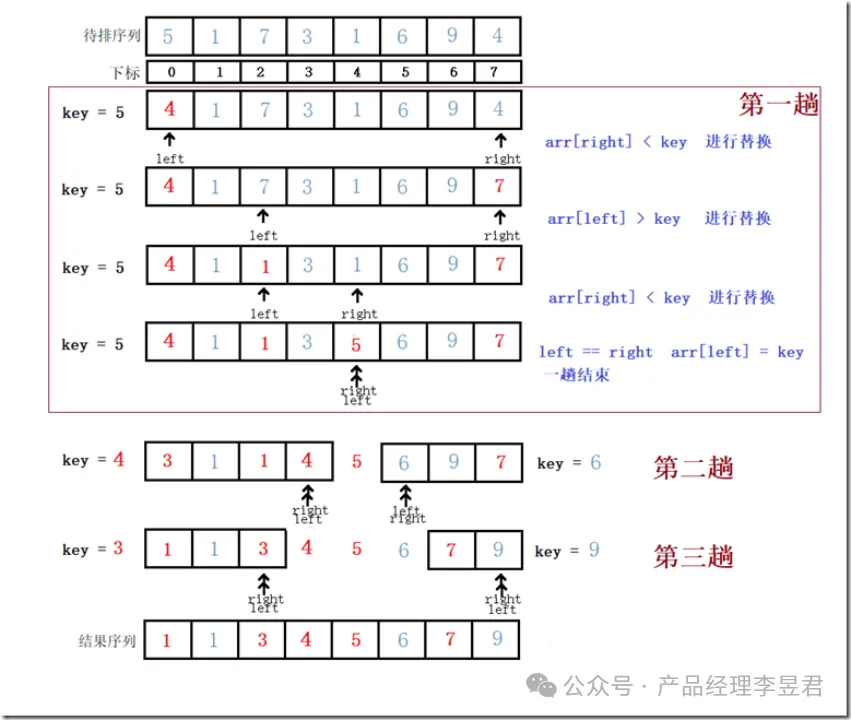
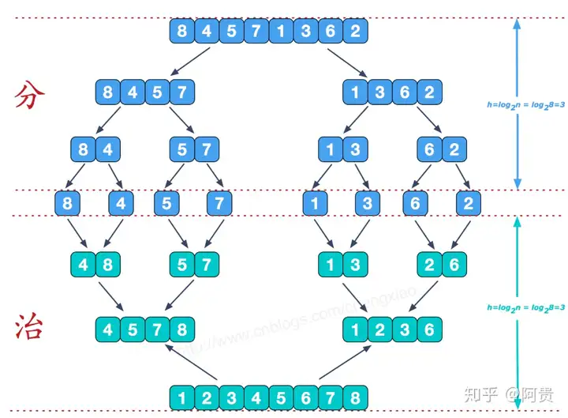
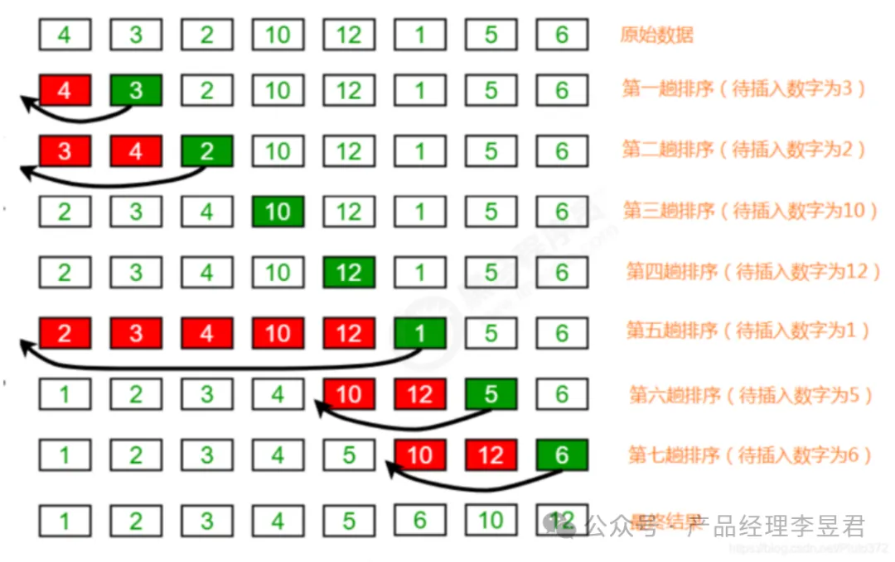
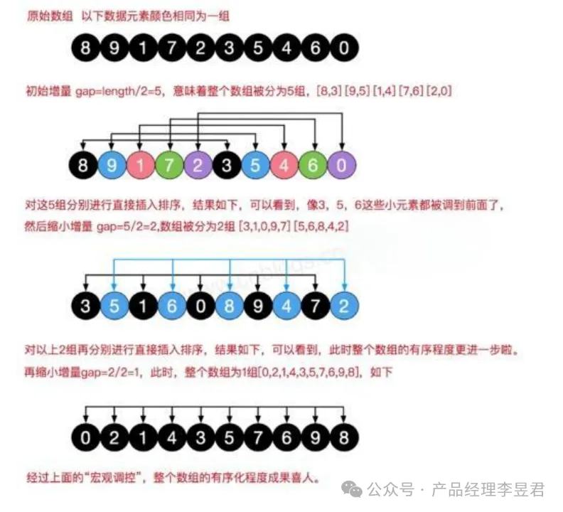
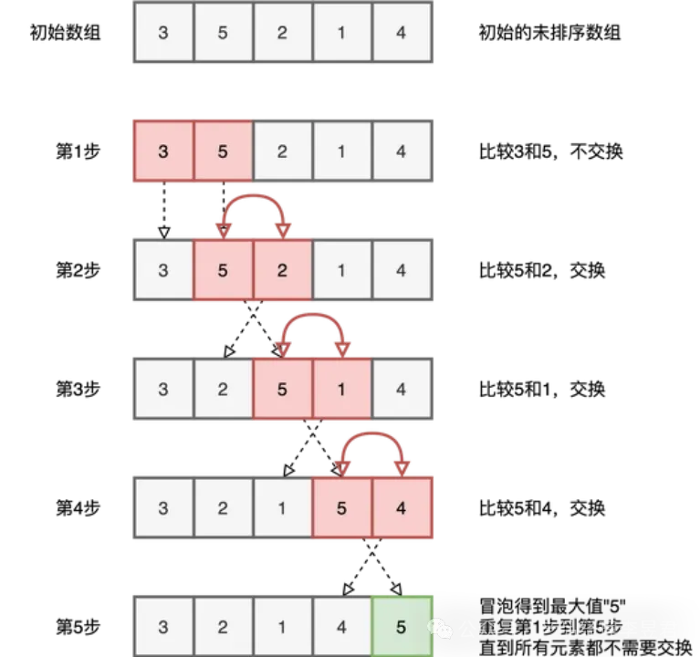
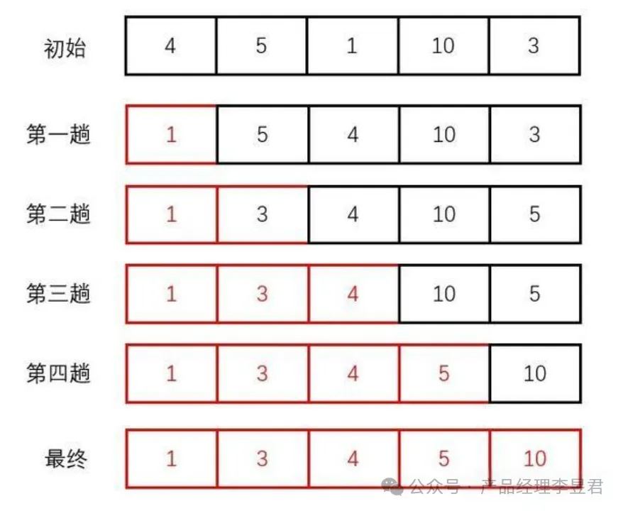

# 排序算法


## Sorting Algotithms Collection 排序算法合集

### 0. 排序算法

排序算法在所有计算机算法，乃至整个计算机领域中，都占据着非常重要的地位。基础算法是软件的核心，而查找算法和排序算法则是计算机基础算法的核心。

排序算法是计算机科学中用于对元素序列进行排序的一系列算法。排序算法在实际应用中非常广泛，比如数据库索引、文件排序、数据检索等。

#### 0.1 定义：

排序算法是一种将一组数据元素重新排列成有序序列的算法。这个“有序”可以是升序或降序。

#### 0.2 作用：

排序算法在许多领域都有广泛的应用，包括但不限于：

•数据分析：对数据进行排序可以更容易地识别数据中的模式和趋势。

•数据库管理：数据库查询经常需要对结果进行排序。

•搜索算法：排序算法可以用于优化搜索过程，如二分搜索依赖于排序好的列表。

•算法实现：许多算法的实现依赖于排序，如归并排序是归并算法的基础。

#### 0.3 分类：

- 按算法的时间复杂度进行分类：
  - O(n^2) 算法：冒泡排序、选择排序、插入排序
  - O(n log n) 算法：快速排序、归并排序、堆排序
  - O(n) 算法：计数排序、桶排序、基数排序

- 按照空间复杂度（内存使用量）进行分类：
  - 原地排序算法（空间复杂度为 O(1)）：冒泡排序、选择排序、插入排序、堆排序
  - 非原地排序算法（空间复杂度大于 O(1)）：归并排序、计数排序

- 按照实现排序的方法进行分类：
  - 插入类排序：直接插入排序、二分插入排序、Shell排序（希尔排序）
  - 交换类排序：冒泡排序、快速排序、随机快速排序
  - 选择类排序：简单选择排序、堆排序
  - 归并类排序：归并排序
  - 分配类排序：计数排序、桶排序、基数排序
  - 混合类排序：鸡尾酒排序（冒泡排序的变体，双向冒泡）
  - 其他排序：拓扑排序、循环排序

### 1. Quick Sort 快速排序

快速排序（Quick Sort）是一种高效的排序算法，由C. A. R. Hoare在1960年提出。它采用分治法的策略，通过选择一个“基准”元素，将数组分为两部分：一部分包含所有小于基准的元素，另一部分包含所有大于基准的元素。然后递归地对这两部分进行快速排序。

#### 1.1 算法步骤

•选择基准：从数组中选择一个元素作为基准。

•分区操作：重新排列数组，所有比基准小的元素放在基准的左边，所有比基准大的元素放在基准的右边。

•递归排序：递归地对基准左边和右边的子数组进行快速排序。

•完成：递归到基情况（数组只有一个或零个元素）时，排序完成。

#### 1.2 算法图解

快速排序通过选择一个基准值，将数组分为两部分，然后递归地对这两部分进行排序。

<br>
<center>
  
  <br>
  <div style="color:orange; border-bottom: 1px solid #d9d9d9; display: inline-block; color: #999; padding: 2px;">BP Network</div>
</center>
<br>

#### 1.3 算法特点

•效率：在大多数情况下，快速排序的平均时间复杂度为O(n log n)。

•不稳定性：快速排序是不稳定的排序算法，因为在分区过程中可能会改变相同元素的相对顺序。

•时间复杂度：平均情况下为O(n log n)，但在最坏情况下（例如，数组已经排序或完全逆序）为O(n^2)。

•空间复杂度：O(log n)，快速排序是原地排序算法，但递归性质导致它需要O(log n)的额外栈空间。


#### 1.4 代码实现
```c++
void quick_sort(vector<int>& nums, int l, int r) {
  if (l >= r) {
    return;
  }

  int first = l, last = r - 1, key = nums[first];
  while (first < last) {
    while (first < last && nums[last] >= key) {
      --last;
    }
    nums[first] = nums[last];
    while (first < last && nums[first] <= key) {
      ++first;
    }
    nums[last] = nums[first];
  }
  nums[first] = key;
  quick_sort(nums, l, first);
  quick_sort(nums, first + 1, r);
}
```

```python
def quick_sort(arr, low, high):
  if low < high:
    # 分区操作
    pivot_index = partition(arr, low, high)
    # 递归地对基准左边和右边的子数组进行快速排序
    quick_sort(arr, low, pivot_index - 1)
    quick_sort(arr, pivot_index + 1, high)

def partition(arr, low, high):
  # 选择基准（这里以最右侧的元素作为基准）
  pivot = arr[high]
  i = low - 1
  for j in range(low, high):
    if arr[j] < pivot:
      i += 1
      arr[i], arr[j] = arr[j], arr[i]
  # 将基准放到正确的位置
  arr[i + 1], arr[high] = arr[high], arr[i + 1]
  return i + 1

# 示例
arr = [10, 7, 8, 9, 1, 5]
quick_sort(arr, 0, len(arr) - 1)
print("Sorted array is:", arr)
```

### 2. Merge Sort 归并排序

归并排序（Merge Sort）是一种分治算法，由约翰·冯·诺伊曼在1945年发明。它通过递归地将数组分成两半，然后对每一半进行排序，最后将排序好的两半合并在一起，从而完成整个数组的排序。

#### 2.1 算法步骤

•分割：将待排序的数组分成两半，直到每个子数组只包含一个元素。

•递归排序：递归地对每个子数组进行归并排序。

•合并：将排序好的两个子数组合并成一个有序数组。


#### 2.2 算法图解

归并排序通过递归地将数组分成更小的部分，然后合并这些部分，直到整个数组被排序。

<br>
<center>
  
  <br>
  <div style="color:orange; border-bottom: 1px solid #d9d9d9; display: inline-block; color: #999; padding: 2px;">BP Network</div>
</center>
<br>

<br>
<center>
  
  <br>
  <div style="color:orange; border-bottom: 1px solid #d9d9d9; display: inline-block; color: #999; padding: 2px;">BP Network</div>
</center>
<br>

#### 2.3 算法特点

•稳定性：归并排序是一种稳定的排序算法，因为它不会改变相同元素的相对顺序。

•时间复杂度：无论最好、最坏还是平均情况下，时间复杂度都是O(n log n)。

•空间复杂度：O(n)，归并排序需要使用到额外的空间来存储临时的合并结果。


#### 2.4 代码实现

```c++
void print_arr(vector<int>& nums) {
  for (auto num:nums) {
    std::cout << num << " ";
  }
  std::cout << std::endl;
}

void merge(vector<int>& nums, int low, int mid, int high) {
  vector<int> tmp (high - low + 1);
  int i = low;
  int j = mid + 1;
  int k = 0;
  while (i <= mid && j <= high) {
    if (nums[i] < nums[j]) {
      tmp[k++] = nums[i++];
    } else {
      tmp[k++] = nums[j++];
    }
  }
  while (i <= mid) {
    tmp[k++] = nums[i++];
  }
  while (j <= high) {
    tmp[k++] = nums[j++];
  }
  for (int i = 0; i < tmp.size(); ++i) {
    nums[low+i] = tmp[i];
  }
}

void merge_sort(vector<int>& nums, int l, int r) {
  if (l == r) return;

  int mid = l + (r - l) / 2;
  merge_sort(nums, l, mid);
  merge_sort(nums, mid + 1, r);

  merge(nums, l, mid, r);
}

int main() {
  vector<int> arr = {64, 34, 25, 12, 22, 11, 90};
  print_arr(arr);
  merge_sort(arr, 0, arr.size() - 1);
  print_arr(arr);
  return 0;
}
```

```python
Python
def merge_sort(arr):
  if len(arr) > 1:
    mid = len(arr) // 2  # 找到中间位置
    L = arr[:mid]  # 左侧序列
    R = arr[mid:]  # 右侧序列

    merge_sort(L)  # 递归对左侧序列进行排序
    merge_sort(R)  # 递归对右侧序列进行排序

    # 合并两个排序好的序列
    i = j = k = 0

    # 按顺序合并元素直到一个子数组为空
    while i < len(L) and j < len(R):
      if L[i] < R[j]:
        arr[k] = L[i]
        i += 1
      else:
        arr[k] = R[j]
        j += 1
      k += 1

    # 将剩余的元素移到数组的末尾
    while i < len(L):
      arr[k] = L[i]
      i += 1
      k += 1

    while j < len(R):
      arr[k] = R[j]
      j += 1
      k += 1

  return arr

# 示例
arr = [38, 27, 43, 3, 9, 82, 10]
sorted_arr = merge_sort(arr)
print("Sorted array is:", sorted_arr)

```
#### 2.5 适用场景

归并排序由于其稳定性和时间复杂度，适用于以下情况：
  •大数据集：归并排序适合处理大型数据集，因为它的性能不会受到数据规模的影响。
  •稳定性需求：当排序过程中保持元素的相对顺序很重要时，归并排序是一个合适的选择。
  •外存排序：归并排序适合于磁盘等外存上的排序，因为它可以有效地减少读取和写入的次数。
  •内存限制：尽管归并排序需要额外的内存空间，但通过优化可以实现为原地排序，从而减少内存使用。

### 3. Insertion Sort 插入排序

插入排序（Insertion Sort）是一种简单直观的排序算法，它通过构建有序序列，对于未排序数据，在已排序序列中从后向前扫描，找到相应位置并插入。

#### 3.1 算法步骤

•开始：假设序列中第一个元素已经排序；

•插入：取下一个未排序的元素，与已排序序列中的元素从后向前比较；

•移动：如果已排序序列中的元素比当前元素大，则将该元素移到下一位；

•插入：将当前元素放到合适的位置；

•重复：对序列中剩余的每个元素重复步骤2-4。

#### 3.2 算法图解

插入排序通过将每个元素插入到前面已排序序列中的适当位置，从而逐步构建完整的有序序列。

<br>
<center>
  
  <br>
  <div style="color:orange; border-bottom: 1px solid #d9d9d9; display: inline-block; color: #999; padding: 2px;">BP Network</div>
</center>
<br>

动态示意图:

<br>
<center>
  
  <br>
  <div style="color:orange; border-bottom: 1px solid #d9d9d9; display: inline-block; color: #999; padding: 2px;">插入排序示意图</div>
</center>
<br>

#### 3.3 算法特点

•简单：插入排序的原理和实现都很简单，容易理解和编程实现。

•稳定：插入排序是一种稳定的排序算法，因为它不会改变相同元素的相对顺序。

•时间复杂度：在最好的情况下（即数列已经是排序状态），时间复杂度为O(n)；在最坏和平均情况下，时间复杂度为O(n^2)。

•空间复杂度：O(1)，插入排序是原地排序，不需要额外的存储空间。

#### 3.4 代码实现


```c++
def insertion_sort(arr):
  # 从第二个元素开始遍历，因为第一个元素可以认为已经排序
  for i in range(1, len(arr)):
    key = arr[i]
    # 从当前元素的前一个元素开始，向前遍历已排序的元素
    j = i - 1
    # 将大于key的元素向后移动
    while j >= 0 and key < arr[j]:
        arr[j + 1] = arr[j]
        j -= 1
    # 将key放到正确的位置
    arr[j + 1] = key
  return arr

# 示例
arr = [12, 11, 13, 5, 6]
sorted_arr = insertion_sort(arr)
print("Sorted array is:", sorted_arr)
```

```c++
void insertion_sort(vector<int>& nums) {
  int n = nums.size();
  for (int i = 1; i < n; ++i) {
    int key = nums[i];
    int j = i - 1;
    while (j >= 0 && nums[j] > key) {
      nums[j+1] = nums[j];
      j--;
    }
    nums[j+1] = key;
  }
}
```

#### 3.5 适用场景

插入排序虽然在最坏情况下效率不高，但在以下情况下可能很有用：

•数据规模较小：对于小型数据集，插入排序的性能是可接受的。

•初始数据部分有序：如果数据集已经部分有序，插入排序的性能会接近线性。

•教学目的：由于其简单性，插入排序常被用作教学示例，帮助初学者理解算法和排序的基本概念。

•在线排序：插入排序适合在线排序，即数据逐个到来时进行排序。

### 4. 希尔排序(Shell Sorting)

希尔排序是插入排序的一种更高效的改进版本，也称为缩小增量排序。它通过引入一个“增量”的概念来优化插入排序，允许进行较远距离的元素交换，从而减少比较和移动的次数。

#### 4.1 算法步骤

•开始：选择一个增量序列，它可以是固定的，也可以是动态生成的。

•排序：使用插入排序对增量序列定义的子序列进行排序。

•缩小：减小增量序列的值，重复上一步，直到增量为1。

•完成：当增量为1时，整个数组将被排序。

#### 4.2 算法图解

希尔排序通过将原始数据分成多个子序列，每个子序列的元素之间相隔特定的增量。然后对每个子序列进行插入排序，随着增量的减小，子序列的间隔也逐渐减小，直到增量为1，此时整个数组已经接近有序，最终进行一次普通的插入排序即可完成排序。

<br>
<center>
  
  <br>
  <div style="color:orange; border-bottom: 1px solid #d9d9d9; display: inline-block; color: #999; padding: 2px;">BP Network</div>
</center>
<br>

#### 4.3 算法特点

•效率：希尔排序的效率依赖于增量序列的选择，通常比普通插入排序要快。

•稳定性：希尔排序是不稳定的排序算法，因为它在插入排序过程中可能会改变相同元素的相对顺序。

•时间复杂度：希尔排序的平均时间复杂度为O(n^1.5)到O(n^2)，这取决于增量序列的选择。在最好的情况下，时间复杂度可以接近O(n log n)。

•空间复杂度：O(1)，希尔排序是原地排序，不需要额外的存储空间。

#### 4.4 代码实现

```c++
void print_arr(vector<int>& nums) {
  for (auto num:nums) {
    std::cout << num << " ";
  }
  std::cout << std::endl;
}

void shell_sort(vector<int>& nums) {
  int n = nums.size();
  int len = n / 2;
  while (len > 0) {
    for (int i = len; i < n; i++) {
      int j = i;
      int temp = nums[i];
      while (j - len >= 0 && temp < nums[j - len]) {
        nums[j] = nums[j - len];
        j -= len;
      }
      nums[j] = temp;
    }
    len = len / 2;
  }
  return;
}

int main() {
  vector<int> arr = {64, 34, 25, 12, 22, 11, 90};
  print_arr(arr);
  shell_sort(arr);
  print_arr(arr);
  return 0;
}
```

```python
def shell_sort(arr):
  n = len(arr)
  gap = n // 2  # 初始增量
  while gap > 0:
    for i in range(gap, n):
      temp = arr[i]
      j = i
      # 对子序列进行插入排序
      while j >= gap and arr[j - gap] > temp:
        arr[j] = arr[j - gap]
        j -= gap
      arr[j] = temp
    gap //= 2  # 减小增量
  return arr

# 示例
arr = [12, 11, 13, 5, 6, 7, 10, 9]
sorted_arr = shell_sort(arr)
print("Sorted array is:", sorted_arr)
```

#### 4.5 适用场景

希尔排序由于其较好的性能，适用于以下情况：

•中等数据规模：对于数据规模不是非常大的情况，希尔排序可以提供比普通插入排序更好的性能。

•初始数据部分有序：如果数据部分有序，希尔排序的性能会有所提升。

•增量序列选择：通过精心选择增量序列，希尔排序可以接近于O(n log n)的时间复杂度，从而在某些情况下比快速排序等算法更高效。


### 5. Bubble Sort 冒泡排序

冒泡排序（Bubble Sort）是一种简单的排序算法，它重复地遍历要排序的数列，一次比较两个元素，如果它们的顺序错误就把它们交换过来。遍历数列的工作是重复进行直到没有再需要交换，也就是说该数列已经排序完成。

#### 5.1 算法步骤

•开始：从数列的第一个元素开始，比较相邻的两个元素。

•比较与交换：如果左边的元素大于右边的元素，就交换它们两个。

•移动：移动到下一个元素对，重复步骤2。

•重复：继续这个过程，直到最后一次交换发生，此时数列的最后一个元素是最大的，已经被“冒泡”到它应该在的位置。

•减少比较次数：由于最大的元素已经在它应在的位置，所以下一次遍历可以减少一个比较（即从第一个元素开始，不需要再和它比较）。

#### 5.2 算法图解
冒泡排序从头开始，依次比较数组中相邻的2个元素，如果后面的数比前面的数大，则交换2个数，否则不交换。每进行一轮比较，都会把数组中最大的元素放到最后面。

<br>
<center>
    
    <br>
    <div style="color:orange; border-bottom: 1px solid #d9d9d9; display: inline-block; color: #999; padding: 2px;">BP Network</div>
</center>
<br>

#### 5.3 算法特点
- 简单：冒泡排序的原理简单，容易实现。
- 稳定：冒泡排序是一种稳定的排序算法，因为它不会改变相同元素之间的顺序。
- 时间复杂度：平均和最坏时间复杂度均为O(n^2)，其中n是数列的长度。在最好的情况下（即数列已经是排序状态），时间复杂度为O(n)。
- 空间复杂度：O(1)，因为冒泡排序是原地排序，不需要额外的存储空间。


#### 5.4 代码实现

```python
def bubble_sort(arr):
  n = len(arr)
  swapped = False
  for i in range(n):
      # 由于每次最大的元素都会被放到它应在的位置，所以可以减少比较次数
    swapped = False
    for j in range(0, n-i-1):
      # 相邻元素两两比较
      if arr[j] > arr[j+1]:
        # 发现元素顺序错误，交换它们
        arr[j], arr[j+1] = arr[j+1], arr[j]
        swapped = True
    if not flag:
        break
  return arr

# 示例
arr = [64, 34, 25, 12, 22, 11, 90]
sorted_arr = bubble_sort(arr)
print("Sorted array is:", sorted_arr)
```

```c++
void print_arr(vector<int>& nums) {
  for (auto num:nums) {
    std::cout << num << " ";
  }
  std::cout << std::endl;
}

void bubble_sort(vector<int>& nums) {
  int n = nums.size();
  bool swapped = false;
  for (int i = 0; i < n; ++i) {
    swapped = false;
    for (int j = 0; j < n - i - 1; ++j) {
      if (nums[j] > nums[j+1]) {
        swap(nums[j], nums[j+1]);
        swapped = true;
      }
    }
    if (!swapped) { // 一旦没有交换操作，说明已经完成排序，可以跳出循环
      break;
    }
  }
}

int main() {
  vector<int> arr = {64, 34, 25, 12, 22, 11, 90};
  print_arr(arr);
  bubble_sort(arr);
  print_arr(arr); // 11 12 22 25 34 64 90
  return 0;
}
```

#### 5.5 使用场景

冒泡排序由于其性能原因，通常不适用于大型数据集的排序。然而，它在以下情况下可能很有用：
- 数据规模较小：当数据集很小或者几乎已经排序时，冒泡排序的性能是可接受的。
- 教学目的：由于其简单性，冒泡排序常被用作教学示例，帮助初学者理解算法和排序的基本概念。
- 需要稳定性：在某些特定情况下，保持元素的相对顺序很重要，冒泡排序可以满足这种稳定性需求。

### 6. 选择排序

选择排序是一种简单直观的排序算法，它的工作原理是每一次从待排序的数据元素中选出最小（或最大）的一个元素，存放在序列的起始位置，直到全部待排序的数据元素排完。

#### 6.1 算法步骤

•开始：在未排序序列中找到最小（大）元素；

•交换：将找到的最小（大）元素与序列的第0个元素交换；

•移动：从序列的第1个元素开始，继续寻找最小（大）元素，然后与序列的第1个元素交换；

•重复：重复步骤2和3，直到序列的第n-1个元素（其中n是序列的长度）。

#### 6.2 算法图解

选择排序通过重复扫描数组，找到最小的元素，然后将其与当前位置的元素交换。这个过程会一直进行，直到整个数组被排序。

<br>
<center>
  
  <br>
  <div style="color:orange; border-bottom: 1px solid #d9d9d9; display: inline-block; color: #999; padding: 2px;">BP Network</div>
</center>
<br>

#### 6.3 算法特点

•简单：选择排序的实现相对简单，容易理解和编程实现。

•不稳定：选择排序在交换过程中可能会改变相同元素的顺序，因此它不是稳定的排序算法。

•时间复杂度：无论最好、最差还是平均情况下，时间复杂度都是O(n^2)，其中n是数列的长度。

•空间复杂度：O(1)，选择排序是原地排序，不需要额外的存储空间。

#### 6.4 代码实现

```python
def selection_sort(arr):
  n = len(arr)
  for i in range(n-1):
    # 找到最小元素的索引
    min_idx = i
    for j in range(i+1, n):
      if arr[j] < arr[min_idx]:
          min_idx = j
    # 将找到的最小元素交换到序列的前面
    arr[i], arr[min_idx] = arr[min_idx], arr[i]
  return arr

# 示例
arr = [64, 34, 25, 12, 22, 11, 90]
sorted_arr = selection_sort(arr)
print("Sorted array is:", sorted_arr)

```
```c++
void print_arr(vector<int>& nums) {
  for (auto num:nums) {
    std::cout << num << " ";
  }
  std::cout << std::endl;
}

void selection_sort(vector<int>& nums) {
  int mid_idx;
  int n = nums.size();
  for (int i = 0; i < n - 1; ++i) {
    mid_idx = i;
    for (int j = i + 1; j < n; ++j) {
      if (nums[j] < nums[mid_idx]) {
        mid_idx = j;
      }
    }
    swap(nums[mid_idx], nums[i]);
  }
}

int main() {
  vector<int> arr = {64, 34, 25, 12, 22, 11, 90};
  print_arr(arr);
  selection_sort(arr);
  print_arr(arr);
  return 0;
}
```

#### 6.5 适用场景

选择排序的性能相对较差，因此它不适用于大型数据集的排序。然而，在以下情况下，选择排序可能比较适用：

•数据规模较小：当数据集较小时，选择排序的简单性可能使其成为一个合适的选择。

•教学目的：由于其实现简单，选择排序常被用作教学示例，帮助初学者理解算法和排序的基本概念。

•排序过程中的特定操作：在某些特定的应用场景中，如果排序过程中需要频繁地访问未排序部分的元素，选择排序可能比其他算法更合适。。


### 6. 堆排序

### 7. 计数排序

### 8. 桶排序


## Reference:
[1]. https://mp.weixin.qq.com/s/P8MmmMc4vB_I9tnK3towLQ

---

> 作者: [Jian YE](https://github.com/jianye0428)  
> URL: https://jianye0428.github.io/posts/sortingalgo/  

