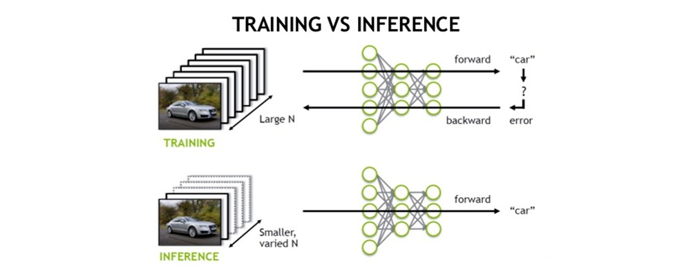
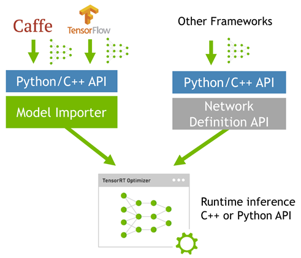
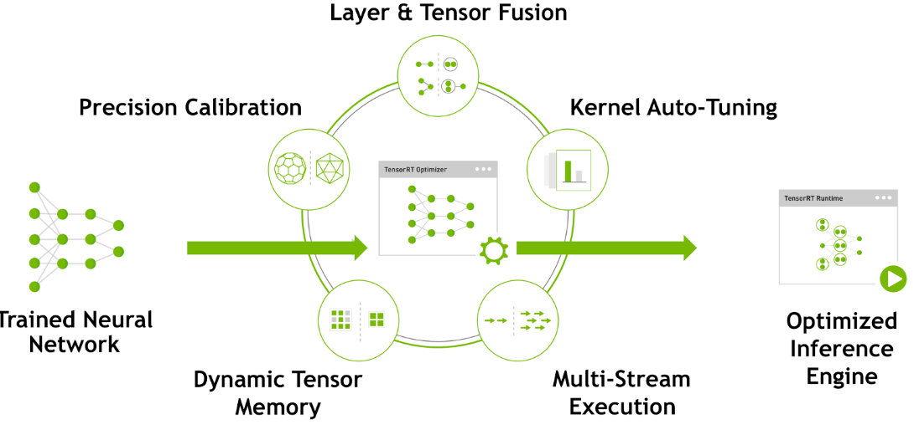
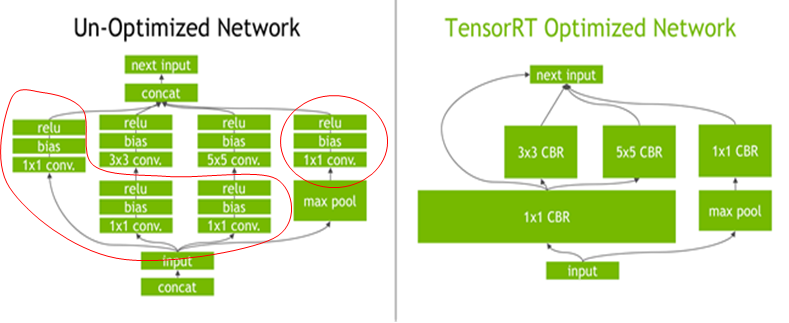

# TensorRT Introduction


### TensorRT 介绍

TensorRT是一个高性能的深度学习推理（Inference）优化器，可以为深度学习应用提供低延迟、高吞吐率的部署推理。TensorRT可用于对超大规模数据中心、嵌入式平台或自动驾驶平台进行推理加速。TensorRT现已能支持TensorFlow、Caffe、Mxnet、Pytorch等几乎所有的深度学习框架，将TensorRT和NVIDIA的GPU结合起来，能在几乎所有的框架中进行快速和高效的部署推理。

TensorRT 是一个C++库，从 TensorRT 3 开始提供C++ API和Python API，主要用来针对 NVIDIA GPU进行 高性能推理（Inference）加速。



由以上图可以很清楚的看出，训练(training)和 推理(inference)的区别：

- **训练(training)**包含了前向传播和后向传播两个阶段，针对的是训练集。训练时通过误差反向传播来不断修改网络权值(weights)。
- **推理(inference)**只包含前向传播一个阶段，针对的是除了训练集之外的新数据。可以是测试集，但不完全是，更多的是整个数据集之外的数据。其实就是针对新数据进行预测，预测时，速度是一个很重要的因素。

一般的深度学习项目，训练时为了加快速度，会使用多GPU分布式训练。但在部署推理时，为了降低成本，往往使用单个GPU机器甚至嵌入式平台（比如 NVIDIA Jetson）进行部署，部署端也要有与训练时相同的深度学习环境，如caffe，TensorFlow等。

由于训练的网络模型可能会很大（比如，inception，resnet等），参数很多，而且部署端的机器性能存在差异，就会导致推理速度慢，延迟高。这对于那些高实时性的应用场合是致命的，比如自动驾驶要求实时目标检测，目标追踪等。所以为了提高部署推理的速度，出现了很多轻量级神经网络，比如squeezenet，mobilenet，shufflenet等。基本做法都是基于现有的经典模型提出一种新的模型结构，然后用这些改造过的模型重新训练，再重新部署。

而tensorRT 则是对训练好的模型进行优化。 tensorRT就只是 推理优化器。当你的网络训练完之后，可以将训练模型文件直接丢进tensorRT中，而不再需要依赖深度学习框架（Caffe，TensorFlow等），如下:



可以认为tensorRT是一个只有前向传播的深度学习框架，这个框架可以将 Caffe，TensorFlow的网络模型解析，然后与tensorRT中对应的层进行一一映射，把其他框架的模型统一全部 转换到tensorRT中，然后在tensorRT中可以针对NVIDIA自家GPU实施优化策略，并进行部署加速。

目前TensorRT8.0 几乎可以支持所有常用的深度学习框架，对于caffe和TensorFlow来说，tensorRT可以直接解析他们的网络模型；对于caffe2，pytorch，mxnet，chainer，CNTK等框架则是首先要将模型转为 ONNX 的通用深度学习模型，然后对ONNX模型做解析。而tensorflow和MATLAB已经将TensorRT集成到框架中去了。

**ONNX(Open Neural Network Exchange)**是微软和Facebook携手开发的开放式神经网络交换工具，也就是说不管用什么框架训练，只要转换为ONNX模型，就可以放在其他框架上面去inference。这是一种统一的神经网络模型定义和保存方式，上面提到的除了tensorflow之外的其他框架官方应该都对onnx做了支持，而ONNX自己开发了对tensorflow的支持。从深度学习框架方面来说，这是各大厂商对抗谷歌tensorflow垄断地位的一种有效方式；从研究人员和开发者方面来说，这可以使开发者轻易地在不同机器学习工具之间进行转换，并为项目选择最好的组合方式，加快从研究到生产的速度。

ONNX / TensorFlow / Custom deep-learning frame模型的工作方式：


tensorRT中有一个 Plugin 层，这个层提供了 API 可以由用户自己定义tensorRT不支持的层。
TensorRT-plugin


目前TensorRT支持的层有:https://github.com/onnx/onnx-tensorrt/blob/main/docs/operators.md
目前ONNX支持的算子:https://github.com/onnx/onnx/blob/main/docs/Operators.md

### TensorRT 优化方式



TensorRT优化方法主要有以下几种方式，最主要的是前面两种。

- **层间融合或张量融合(Layer & Tensor Fusion)**

    如下图左侧是GoogLeNetInception模块的计算图。这个结构中有很多层，在部署模型推理时，这每一层的运算操作都是由GPU完成的，但实际上是GPU通过启动不同的CUDA（Compute unified device architecture）核心来完成计算的，CUDA核心计算张量的速度是很快的，但是往往大量的时间是浪费在CUDA核心的启动和对每一层输入/输出张量的读写操作上面，这造成了内存带宽的瓶颈和GPU资源的浪费。TensorRT通过对层间的横向或纵向合并（合并后的结构称为CBR，意指 convolution, bias, and ReLU layers are fused to form a single layer），使得层的数量大大减少。横向合并可以把卷积、偏置和激活层合并成一个CBR结构，只占用一个CUDA核心。纵向合并可以把结构相同，但是权值不同的层合并成一个更宽的层，也只占用一个CUDA核心。合并之后的计算图（图4右侧）的层次更少了，占用的CUDA核心数也少了，因此整个模型结构会更小，更快，更高效。


    

- **数据精度校准(Weight &Activation Precision Calibration)**

    大部分深度学习框架在训练神经网络时网络中的张量（Tensor）都是32位浮点数的精度（Full 32-bit precision，FP32），一旦网络训练完成，在部署推理的过程中由于不需要反向传播，完全可以适当降低数据精度，比如降为FP16或INT8的精度。更低的数据精度将会使得内存占用和延迟更低，模型体积更小。

    |Precision|	Dynamic Range|
    |:----------:|:------------------:|
    |     FP32   | −3.4×1038 +3.4×1038|
    |     FP16 	 |   −65504 +65504    |
    |     INT8 	 |    −128 +127       |

    INT8只有256个不同的数值，使用INT8来表示 FP32精度的数值，肯定会丢失信息，造成性能下降。不过TensorRT会提供完全自动化的校准（Calibration ）过程，会以最好的匹配性能将FP32精度的数据降低为INT8精度，最小化性能损失。

- **Kernel Auto-Tuning**
  网络模型在推理计算时，是调用GPU的CUDA核进行计算的。TensorRT可以针对不同的算法，不同的网络模型，不同的GPU平台，进行 CUDA核的调整（怎么调整的还不清楚），以保证当前模型在特定平台上以最优性能计算。

    TensorRT will pick the implementation from a library of kernels that delivers the best performance for the target GPU, input data size, filter size, tensor layout, batch size and other parameters.

- **Dynamic Tensor Memory**
    在每个tensor的使用期间，TensorRT会为其指定显存，避免显存重复申请，减少内存占用和提高重复使用效率。

- **Multi-Stream Execution**
    Scalable design to process multiple input streams in parallel，这个应该就是GPU底层的优化了。

### TensorRT 安装

**[CUDA的安装](https://zhuanlan.zhihu.com/p/72298520)**

1. 安装显卡驱动
2. 安装cuda
   2.1 进入[nvidia开发者网站的CUDA下载页面](https://developer.nvidia.com/cuda-toolkit-archive)选择runfile格式的文件下载。

   2.2 下载完成后，解压，并运行上图中的命令，会有条款，接受即可，注意安装CUDA的时候不要安装驱动
   
   2.3 路径设置
    ```shell
    $ export PATH=/usr/local/cuda-10.2/bin:/usr/local/cuda-10.2/nsight-compute-2019.5.0${PATH:+:${PATH}}
    $ export LD_LIBRARY_PATH=/usr/local/cuda-10.2/lib64/${LD_LIBRARY_PATH:+:${LD_LIBRARY_PATH}}
    ```
    并使设置生效:
    ```shell
    source ~/.bashrc
    ```
    2.4 验证安装是否成功
    进入/usr/local/cuda-10.1/samples/1_Utilities/目录，
    ```shell
    cd deviceQuery
    sudo make
    ./deviceQuery
    ```
    出现如下输出，则CUDA安装成功。
    

3. 安装cuDNN
   3.1进入[cudnn下载](https://developer.nvidia.com/cudnn)页面，下载版本合适的版
   3.2 解压，并进入到相应目录，运行以下命令：

    ```shell
    sudo cp cuda/include/cudnn*.h /usr/local/cuda-10.2/include
    sudo cp cuda/lib64/libcudnn* /usr/local/cuda-10.2/lib64
    sudo chmod a+r /usr/local/cuda-10.2/include/cudnn*.h
    sudo chmod a+r /usr/local/cuda-10.2/lib64/libcudnn*
    ```
    3.3 查看cudnn版本

    ```shell
    cat /usr/local/cuda-10.2/include/cudnn.h | grep CUDNN_MAJOR -A 2
    ```
    新版本:

    ```shell
    cat /usr/local/cuda-10.2/include/cudnn_version.h | grep CUDNN_MAJOR -A 2
    ```
    ref: https://blog.csdn.net/weixin_43592742/article/details/115689886?utm_medium=distribute.pc_relevant.none-task-blog-baidujs_title-0&spm=1001.2101.3001.4242

**[TensorRT的安装](https://github.com/nvidia/TensorRT)**

[英伟达提供的安装指导](https://docs.nvidia.com/deeplearning/tensorrt/install-guide/index.html)

> tensorRT 要匹配cuda和cudnn版本。在安装之前请匹配。

OSS 和 GA 两个版本:
1. TensorRT OSS:
    ```shell
    git clone -b master https://github.com/nvidia/TensorRT TensorRT
    cd TensorRT
    git submodule update --init --recursive
    ```
2. GA 版本([下载地址](https://developer.nvidia.com/nvidia-tensorrt-download))

3. 对GA版本和OSS版本在`~/.bashrc`文件中声明路径:
   (GA: General Availability Stable Version)
   (OSS: OPEN SOURCE)
   1. [oss版本路径]export TRT_SOURCE=/home/yejian/TensorRT/TensorRT_7.2.1
   2. [GA Release 版本路径]export TRT_RELEASE=/home/yejian/TensorRT/TensorRT_7.2.1/TensorRT-7.2.1.6/TensorRT-7.2.1.6


4. Build TensorRT RSS (这一步需要在编写自定义算子的时候编译通过，参能调用自定义算子)
    ```
    cd $TRT_OSSPATH
    mkdir -p build && cd build
    cmake .. -DTRT_LIB_DIR=$TRT_LIBPATH -DTRT_OUT_DIR=`pwd`/out
    make -j$(nproc)
    ```

## 自定义算子开发 -- ScatterElements

在自定义算子开发过程中，需要撰写一下4个文件，并且把文件放在scatterElementsPlugin文件夹中:

- `CmakeLists.txt`
- `scatterElements.cu`
- `scatterElementsPlugin.cpp`
- `scatterElementsPlugin.h`

如图所示:


**自定义算子的生成与注册**

- 将以上四个文件报括文件夹复制到TensorRT(OOS)下的plugin文件夹下;
- 然后修改注册信息文件:(这些文件也在plugin文件夹下)
  - `${TRT_SOURCE}/plugin: CMakeLists.txt`
  - `${TRT_SOURCE}/InferPlugin.cpp`
  - `${TRT_SOURCE}/common/kernels/kernel.h`
  - `${TRT_SOURCE}/parsers/onnx/builtin_op_importers.cpp`

执行完以上步骤以后，重新编译OOS版本，然后就可以调用自定义算子:

```shell
cd $TRT_OSSPATH
mkdir -p build && cd build
cmake .. -DTRT_LIB_DIR=$TRT_LIBPATH -DTRT_OUT_DIR=`pwd`/out
make -j$(nproc)
```


---

> 作者: [Jian YE](https://github.com/jianye0428)  
> URL: https://jianye0428.github.io/posts/tensorrt_introduction/  

