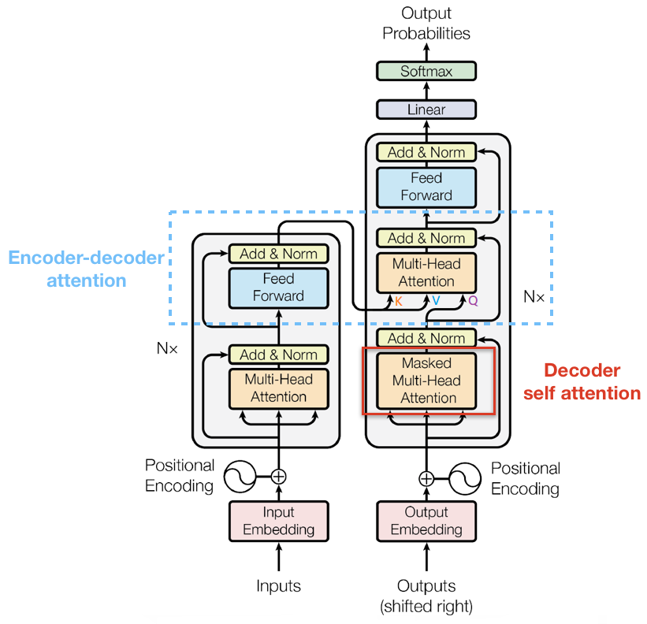
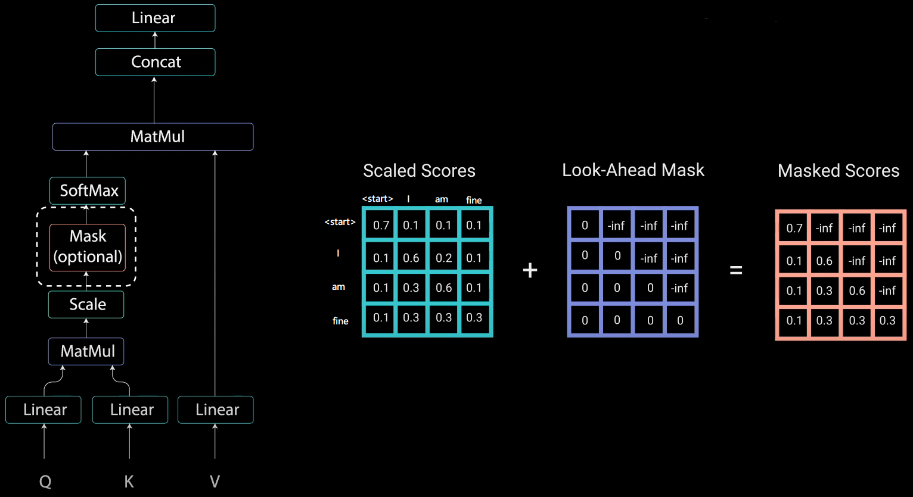

# Transformer 详解


## Transformer 详解

Transformer 是谷歌大脑在 2017 年底发表的论文 [attention is all you need](https://arxiv.org/pdf/1706.03762.pdf) 中所提出的 seq2seq 模型。现在已经取得了大范围的应用和扩展，而 BERT 就是从 Transformer 中衍生出来的预训练语言模型

这篇文章分为以下几个部分
  - Transformer 直观认识</br>
  - Positional Encoding</br>
  - Self Attention Mechanism</br>
  - 残差连接和 Layer Normalization</br>
  - Transformer Encoder 整体结构</br>
  - Transformer Decoder 整体结构</br>
  - 总结</br>
  - 参考文章</br>

### 0. Transformer 直观认识

Transformer 和 LSTM 的最大区别，就是 <font color=green>LSTM 的训练是迭代的、串行的，必须要等当前字处理完，才可以处理下一个字</font>。而 Transformer 的训练时**并行**的，即所有字是同时训练的，这样就大大增加了计算效率。<font color=green>Transformer 使用了位置嵌入 (Positional Encoding) 来理解语言的顺序</font>，使用自注意力机制(Self Attention Mechanism)和全连接层进行计算，这些后面会讲到。

Transformer 模型主要分为两大部分，分别是 Encoder 和 Decoder。<font color=red>Encoder 负责把输入(语言序列)映射成隐藏层(下图中第 2 步用九宫格代表的部分)，然后解码器再把隐藏层映射为自然语言序列</font>。例如下图机器翻译的例子(Decoder 输出的时候，是通过 N 层 Decoder Layer 才输出一个 token，并不是通过一层 Decoder Layer 就输出一个 token)。


本篇文章大部分内容在于解释 Encoder 部分，即把自然语言序列映射为隐藏层的数学表达的过程。理解了 Encoder 的结构，再理解 Decoder 就很简单了


上图为 Transformer Encoder Block 结构图，注意：下面的内容标题编号分别对应着图中 1,2,3,4 个方框的序号

### 1. Positional Encoding

由于 Transformer 模型没有循环神经网络的迭代操作，所以我们必须提供每个字的位置信息给 Transformer，这样它才能<font color=red>识别出语言中的顺序关系</font>。

现在定义一个**位置嵌入**的概念，也就是 Positional Encoding，位置嵌入的维度为 [max_sequence_length, embedding_dimension], 位置嵌入的维度与词向量的维度是相同的，都是 embedding_dimension。max_sequence_length 属于超参数，指的是限定每个句子最长由多少个词构成

注意，我们一般以字为单位训练 Transformer 模型。首先初始化字编码的大小为 [vocab_size, embedding_dimension]，vocab_size 为字库中所有字的数量，embedding_dimension 为字向量的维度，对应到 PyTorch 中，其实就是 nn.Embedding(vocab_size, embedding_dimension)

论文中使用了 sin 和 cos 函数的线性变换来提供给模型位置信息:

$$\left\\{\begin{aligned}
PE(pos, 2i) = \sin (pos/10000^{2i/d\_{model}}) \cr
PE(pos, 2i + 1) = \cos (pos/10000^{2i/d\_{model}}) \cr
\end{aligned}\right.$$

上式中 $pos$ 指的是一句话中某个字的位置，取值范围是 $[0, \text{max \_ sequence\_ length}]$ ， $i$ 指的是字向量的维度序号，取值范围是 $[0, \text{embedding\_ dimension} / 2]$ ， $d\_{model}$ 指的是 embedding_dimension​的值

上面有 sin 和 cos 一组公式，也就是对应着 embedding_dimension 维度的一组奇数和偶数的序号的维度，例如 0,1 一组，2,3 一组，分别用上面的 sin 和 cos 函数做处理，从而产生不同的周期性变化，而位置嵌入在 embedding_dimension​维度上随着维度序号增大，周期变化会越来越慢，最终产生一种包含位置信息的纹理，就像论文原文中第六页讲的，位置嵌入函数的周期从 $ 2\pi $ 到 $10000 * 2 \pi$ 变化，而每一个位置在 embedding_dimension ​维度上都会得到不同周期的 $ \sin $ 和 $ \cos $ 函数的取值组合，从而产生独一的纹理位置信息，最终使得模型学到**位置之间的依赖关系和自然语言的时序特性**。

如果不理解这里为何这么设计，可以看这篇文章 [Transformer 中的 Positional Encoding](https://wmathor.com/index.php/archives/1453/)


下面画一下位置嵌入，纵向观察，可见随着 embedding_dimension​序号增大，位置嵌入函数的周期变化越来越平缓

```python
    import numpy as np
    import matplotlib.pyplot as plt
    import seaborn as sns
    import math

    def get_positional_encoding(max_seq_len, embed_dim):
        # 初始化一个positional encoding
        # embed_dim: 字嵌入的维度
        # max_seq_len: 最大的序列长度
        positional_encoding = np.array([
            [pos / np.power(10000, 2 * i / embed_dim) for i in range(embed_dim)]
            if pos != 0 else np.zeros(embed_dim) for pos in range(max_seq_len)])

        positional_encoding[1:, 0::2] = np.sin(positional_encoding[1:, 0::2])  # dim 2i 偶数
        positional_encoding[1:, 1::2] = np.cos(positional_encoding[1:, 1::2])  # dim 2i+1 奇数
        return positional_encoding

    positional_encoding = get_positional_encoding(max_seq_len=100, embed_dim=16)
    plt.figure(figsize=(10,10))
    sns.heatmap(positional_encoding)
    plt.title("Sinusoidal Function")
    plt.xlabel("hidden dimension")
    plt.ylabel("sequence length")
```


```python
    plt.figure(figsize=(8, 5))
    plt.plot(positional_encoding[1:, 1], label="dimension 1")
    plt.plot(positional_encoding[1:, 2], label="dimension 2")
    plt.plot(positional_encoding[1:, 3], label="dimension 3")
    plt.legend()
    plt.xlabel("Sequence length")
    plt.ylabel("Period of Positional Encoding")
```


### 2. Self Attention Mechanism

对于输入的句子 $ X $，通过 WordEmbedding 得到该句子中每个字的字向量，同时通过 Positional Encoding 得到所有字的位置向量，将其相加(维度相同，可以直接相加)，得到该字真正的向量表示。第 $ t $ 个字的向量记作 $ x\_t $。

接着我们定义三个矩阵 $ W\_Q $, $ W\_K $, $ W\_V $，使用这三个矩阵分别对所有的字向量进行三次线性变换，于是所有的字向量又衍生出三个新的向量 $ q\_t $, $ k\_t $, $ v\_t $。我们将所有的 $ q\_t $ 向量拼成一个大矩阵，记作查询矩阵 $ Q $ ，将所有的 $ k\_t $ 向量拼成一个大矩阵，记作键矩阵 $ K $  ，将所有的 $ v\_t $ 向量拼成一个大矩阵，记作值矩阵 $ V $ (见下图)


为了获得第一个字的注意力权重，我们需要用第一个字的查询向量 $ q\_1 $ 乘以键矩阵 $ K $(见下图)

```
                [0, 4, 2]
    [1, 0, 2] x [1, 4, 3] = [2, 4, 4]
                [1, 0, 1]
```


之后还需要将得到的值经过 softmax，使得它们的和为 1(见下图)

```
 softmax([2, 4, 4]) = [0.0, 0.5, 0.5]
```


有了权重之后，将权重其分别乘以对应字的值向量 $ v\_t $(见下图)

```
    0.0 * [1, 2, 3] = [0.0, 0.0, 0.0]
    0.5 * [2, 8, 0] = [1.0, 4.0, 0.0]
    0.5 * [2, 6, 3] = [1.0, 3.0, 1.5]
```


最后将这些**权重化后的值向量求和**，得到第一个字的输出(见下图)

```
      [0.0, 0.0, 0.0]
    + [1.0, 4.0, 0.0]
    + [1.0, 3.0, 1.5]
    -----------------
    = [2.0, 7.0, 1.5]
```


对其它的输入向量也执行相同的操作，即可得到通过 self-attention 后的所有输出


**矩阵计算**

上面介绍的方法需要一个循环遍历所有的字$ x\_t $，我们可以把上面的向量计算变成矩阵的形式，从而一次计算出所有时刻的输出

第一步就不是计算某个时刻的$ q\_t $, $ k\_t $, $ v\_t $了，而是一次计算所有时刻的 $
Q $, $ K $, $ V $。计算过程如下图所示，这里的输入是一个矩阵 $ X $，矩阵第 $ t $ 行为第 $ t $ 个词的向量表示 $x\_t$


接下来将 $ Q $ 和 $K\_T$ 相乘，然后除以 $ \sqrt{d\_k} $(这是论文中提到的一个 trick)，经过 softmax 以后再乘以 $ V $ 得到输出


**Multi-Head Attention**

这篇论文还提出了 Multi-Head Attention 的概念。其实很简单，前面定义的一组 $Q $, $ K $, $ V $, 可以让一个词 attend to 相关的词，我们可以定义多组 $Q $, $ K $, $ V $，让它们分别关注不同的上下文。计算 $Q $, $ K $, $ V $ 的过程还是一样，只不过线性变换的矩阵从一组 $ W^Q $, $ W^K $, $ W^V $ 变成了多组$ W^Q\_0 $, $ W^K\_0 $, $ W^V\_0 $  ，$ W^Q\_1 $, $ W^K\_1 $, $ W^V\_1 $ ，… 如下图所示:


对于输入矩阵 $ X $ ，每一组 $ Q $ 、$ K $ 和 $ V $ 都可以得到一个输出矩阵 $ Z $ 。如下图所示


**Padding Mask**


上面 Self Attention 的计算过程中，我们通常使用 mini-batch 来计算，也就是一次计算多句话，即 $ X $ 的维度是 `[batch_size, sequence_length]`，sequence_length​是句长，而一个 mini-batch 是由多个不等长的句子组成的，我们需要按照这个 mini-batch 中最大的句长对剩余的句子进行补齐，一般用 0 进行填充，这个过程叫做 padding

但这时在进行 softmax 就会产生问题。回顾 softmax 函数 $\sigma(z\_i) = \frac{e^{z\_i}}{\sum\_K^{j=i} e^{z\_j}}$，$e^0$ 是 1，是有值的，这样的话 softmax 中被 padding 的部分就参与了运算，相当于让无效的部分参与了运算，这可能会产生很大的隐患。因此需要做一个 mask 操作，让这些无效的区域不参与运算，一般是给无效区域加一个很大的负数偏置，即

$$
\begin{aligned}Z\_{illegal}&=Z\_{illegal}+bias\_{illegal}\cr
bias\_{illegal}&\to-\infty\end{aligned}
$$

### 3. 残差连接和 Layer Normalization

**残差连接**

我们在上一步得到了经过 self-attention 加权之后输出，也就是$\text{Self-Attention(Q, K, V)}$，然后把他们加起来做残差连接

$$X\_{\text{embedding}} + \text{Self-Attention(Q, K, V)}$$

**Layer Normalization**

Layer Normalization 的作用是**把神经网络中隐藏层归一为标准正态分布**，也就是 $i.i.d$ 独立同分布，以起到**加快训练速度，加速收敛**的作用

$$\mu\_j=\frac1m\sum\_{i=1}^mx\_{ij}$$

上式以矩阵的列(column)为单位求均值；

$$\sigma^2\_{j} = \frac{1}{m}\sum^m\_{i=1}(x\_{ij} - \mu\_j)^2$$

上式以矩阵的列(column)为单位求方差

$$LayerNorm(x) = \frac{x\_{ij} - \mu\_{j}}{\sqrt{\sigma^2 + \epsilon}}$$

然后用每一列的每一个元素减去这列的均值，再除以这列的标准差，从而得到归一化后的数值，加 $\epsilon$ 是为了防止分母为 0。


下图展示了更多细节：输入 $x\_1, x\_2$ 经 self-attention 层之后变成 $z\_1, z\_2$，然后和输入 $x\_1, x\_2$ 进行残差连接，经过 LayerNorm 后输出给全连接层。全连接层也有一个残差连接和一个 LayerNorm，最后再输出给下一个 Encoder(每个 Encoder Block 中的 FeedForward 层权重都是共享的)


### 4. Transformer Encoder 整体结构

经过上面 3 个步骤，我们已经基本了解了 Encoder 的主要构成部分，下面我们用公式把一个 Encoder block 的计算过程整理一下：

(1). 字向量与位置编码

$$X = \text{Embedding-Lookup(X)} + \text{Positional-Encoding}$$

(2). 自注意力机制

$$Q = Linear\_{q}(X) = XW\_{Q}$$
$$K = Linear\_{k}(X) = XW\_{K}$$
$$V = Linear\_{v}(X) = XW\_{V}$$
$$X\_{attention} = \text{Self-Attention(Q, K, V)}$$

(3). self-attention 残差连接与 Layer Normalization

$$X\_{attention} = X + X\_{attention}$$
$$X\_{attention} = LayerNorm(attention)$$

(4). 下面进行 Encoder block 结构图中的第 4 部分，也就是 FeedForward，其实就是两层线性映射并用激活函数激活，比如说 $ReLU$

$$X\_{hidden} = Linear(ReLU(Linear(X\_{attention})))$$

(5). FeedForward 残差连接与 Layer Normalization

$$X\_{hidden} = X\_{attention} + X\_{hidden}$$
$$X\_{hidden} = LayerNorm(X\_{hidden})$$

其中
$$X\_{hidden} \in \mathbb{R}^{batch\_size * seq\_len * embed\_dim}$$

### 5. Transformer Decoder 整体结构
我们先从 HighLevel 的角度观察一下 Decoder 结构，从下到上依次是：

- Masked Multi-Head Self-Attention
- Multi-Head Encoder-Decoder Attention
- FeedForward Network

和 Encoder 一样，上面三个部分的每一个部分，都有一个残差连接，后接一个 Layer Normalization。Decoder 的中间部件并不复杂，大部分在前面 Encoder 里我们已经介绍过了，但是 Decoder 由于其特殊的功能，因此在训练时会涉及到一些细节




**Masked Self-Attention**

具体来说，传统 Seq2Seq 中 Decoder 使用的是 RNN 模型，因此在训练过程中输入 $t$ 时刻的词，模型无论如何也看不到未来时刻的词，因为循环神经网络是时间驱动的，只有当 $t$ 时刻运算结束了，才能看到 $t + 1$ 时刻的词。而 Transformer Decoder 抛弃了 RNN，改为 Self-Attention，由此就产生了一个问题，<font color=red>在训练过程中，整个 ground truth 都暴露在 Decoder 中</font>，这显然是不对的，我们需要对 Decoder 的输入进行一些处理，该处理被称为 Mask
</br>
举个例子，Decoder 的 ground truth 为 "<start> I am fine"，我们将这个句子输入到 Decoder 中，经过 WordEmbedding 和 Positional Encoding 之后，将得到的矩阵做三次线性变换 $(W\_Q, W\_K, W\_V)$。然后进行 self-attention 操作，首先通过得到 Scaled Scores，接下来非常关键，我们要**对 Scaled Scores 进行 Mask**，举个例子，当我们输入 "I" 时，模型目前仅知道包括 "I" 在内之前所有字的信息，即 "<start>" 和 "I" 的信息，不应该让其知道 "I" 之后词的信息。道理很简单，我们做预测的时候是按照顺序一个字一个字的预测，怎么能这个字都没预测完，就已经知道后面字的信息了呢？Mask 非常简单，首先生成一个下三角全 0，上三角全为负无穷的矩阵，然后将其与 Scaled Scores 相加即可



之后再做 softmax，就能将 - inf 变为 0，得到的这个矩阵即为每个字之间的权重


Multi-Head Self-Attention 无非就是并行的对上述步骤多做几次，前面 Encoder 也介绍了，这里就不多赘述了

**Masked Encoder-Decoder Attention**

其实这一部分的计算流程和前面 Masked Self-Attention 很相似，结构一模一样，唯一不同的是这里的 K, V为 Encoder 的输出，Q 为 Decoder 中 Masked Self-Attention 的输出


### 6. 总结
到此为止，Transformer 中 95% 的内容已经介绍完了，我们用一张图展示其完整结构。不得不说，Transformer 设计的十分巧夺天工。


下面有几个问题，是我从网上找的，感觉看完之后能对 Transformer 有一个更深的理解

<font color=red>Transformer 为什么需要进行 Multi-head Attention？</font>
- 原论文中说到进行 Multi-head Attention 的原因是将模型分为多个头，形成多个子空间，可以让模型去关注不同方面的信息，最后再将各个方面的信息综合起来。其实直观上也可以想到，如果自己设计这样的一个模型，必然也不会只做一次 attention，多次 attention 综合的结果至少能够起到增强模型的作用，也可以类比 CNN 中同时使用多个卷积核的作用，直观上讲，多头的注意力有助于网络捕捉到更丰富的特征 / 信息

<font color=red>Transformer 相比于 RNN/LSTM，有什么优势？为什么？</font>
- RNN 系列的模型，无法并行计算，因为 T 时刻的计算依赖 T-1 时刻的隐层计算结果，而 T-1 时刻的计算依赖 T-2 时刻的隐层计算结果
- Transformer 的特征抽取能力比 RNN 系列的模型要好


<font color=red>为什么说 Transformer 可以代替 seq2seq？</font>
- 这里用代替这个词略显不妥当，seq2seq 虽已老，但始终还是有其用武之地，seq2seq 最大的问题在于**将Encoder端的所有信息压缩到一个固定长度的向量中**，并将其作为 Decoder 端首个隐藏状态的输入，来预测 Decoder 端第一个单词 (token) 的隐藏状态。在输入序列比较长的时候，这样做显然会损失 Encoder 端的很多信息，而且这样一股脑的把该固定向量送入 Decoder 端，Decoder 端不能够关注到其想要关注的信息。
- Transformer 不但对 seq2seq 模型这两点缺点有了实质性的改进 (多头交互式 attention 模块)，而且还引入了 self-attention 模块，让源序列和目标序列首先 “自关联” 起来，这样的话，源序列和目标序列自身的 embedding 表示所蕴含的信息更加丰富，而且后续的 FFN 层也增强了模型的表达能力，并且 Transformer 并行计算的能力远远超过了 seq2seq 系列模型

### 7. 参考文章
- [Transformer](http://mantchs.com/2019/09/26/NLP/Transformer/)
- [The Illustrated Transformer](http://jalammar.github.io/illustrated-transformer/)
- [TRANSFORMERS FROM SCRATCH](http://www.peterbloem.nl/blog/transformers)
- [Seq2seq pay Attention to Self Attention: Part 2](https://medium.com/@bgg/seq2seq-pay-attention-to-self-attention-part-2-%E4%B8%AD%E6%96%87%E7%89%88-ef2ddf8597a4)


ref:</br>
[1]. [B站讲解视频](https://www.bilibili.com/video/BV1mk4y1q7eK?p=1)</br>
[2]. https://wmathor.com/index.php/archives/1438/</br>
[3]. [Transformer的pytorch实现](https://wmathor.com/index.php/archives/1455/)</br>


---

> 作者: [Jian YE](https://github.com/jianye0428)  
> URL: https://jianye0428.github.io/posts/transformerdetailedexplanation/  

