# Transformer Q & A

## 1. 2017年深度学习领域的重大突破是什么？

Transformer。有两方面的原因：

1.1 一方面，Transformer是深度学习领域既MLP、RNN、CNN之后的第4大特征提取器（也被称为基础模型）。什么是特征提取器？大脑是人与外部世界（图像、文字、语音等）交互的方式；特征提取器是计算机为了模仿大脑，与外部世界（图像、文字、语音等）交互的方式，如图1所示。举例而言：Imagenet数据集中包含1000类图像，人们已经根据自己的经验把这一百万张图像分好1000类，每一类图像（如美洲豹）都有独特的特征。这时，神经网络（如ResNet18）也是想通过这种分类的方式，把每一类图像的特有特征尽可能提取或识别出来。分类不是最终目的，而是一种提取图像特征的手段，掩码补全图像也是一种提取特征的方式，图像块顺序打乱也是一种提取特征的方式。

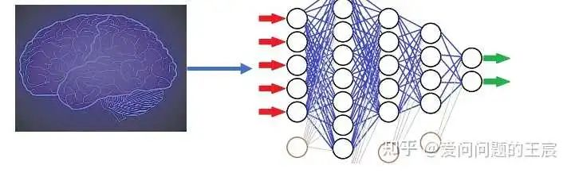

1.2 另一方面，Transformer在深度学习领域扮演的角色：第3次和第4次热潮的基石，如下图2所示。

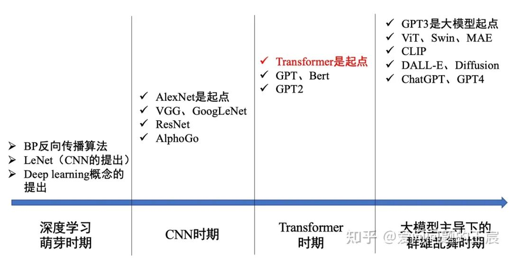

## 2. Transformer的提出背景是什么？

**2.1 在领域发展背景层面**：当时时处2017年，深度学习在计算机视觉领域火了已经几年。从Alexnet、VGG、GoogleNet、ResNet、DenseNet；从图像分类、目标检测再到语义分割；但在自然语言处理领域并没有引起很大反响。

**2.2 技术背景层面**：  
（1）当时主流的序列转录任务（如机器翻译）的解决方案如下图3所示，在Sequence to Sequence架构下（Encoder- Decoder的一种），RNN来提取特征，Attention机制将Encoder提取到的特征高效传递给Decoder。
（2）这种做法有两个不足之处，一方面是在提取特征时的RNN天生从前向后时序传递的结构决定了其无法并行运算，其次是当序列长度过长时，最前面序列的信息有可能被遗忘掉。因此可以看到，在这个框架下，RNN是相对薄弱急需改进的地方。

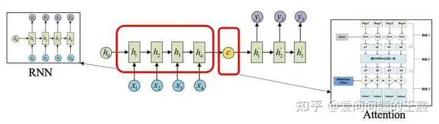

## 3. Transformer到底是什么？

3.1 Transformer是一种由Encoder和Decoder组成的架构。那么什么是架构呢？最简单的架构就是A+B+C。

3.2 Transformer也可以理解为一个函数，输入是“我爱学习”，输出是“I love study”。

3.3 如果把Transformer的架构进行分拆，如图4所示。

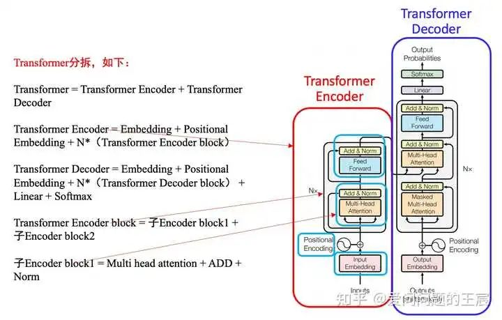

## 4. 什么是Transformer Encoder？

4.1 从功能角度，Transformer Encoder的核心作用是**提取特征**，也有使用Transformer Decoder来提取特征。例如，一个人学习跳舞，Encoder是看别人是如何跳舞的，Decoder是将学习到的经验和记忆，展现出来

4.2 从结构角度，如图5所示，Transformer Encoder = Embedding + Positional Embedding + N*（子Encoder block1 + 子Encoder block2）；

子Encoder block1 = Multi head attention + ADD + Norm；

子Encoder block2 = Feed Forward + ADD + Norm；

4.3 从输入输出角度，N个Transformer Encoder block中的第一个Encoder block的输入为一组向量 X = （Embedding + Positional Embedding），向量维度通常为512*512，其他N个TransformerEncoder block的输入为上一个 Transformer Encoder block的输出，输出向量的维度也为512*512（输入输出大小相同）。

4.4 为什么是512*512？前者是指token的个数，如“我爱学习”是4个token，这里设置为512是为了囊括不同的序列长度，不够时padding。后者是指每一个token生成的向量维度，也就是每一个token使用一个序列长度为512的向量表示。人们常说，Transformer不能超过512，否则硬件很难支撑；其实512是指前者，也就是token的个数，因为每一个token要做self attention操作；但是后者的512不宜过大，否则计算起来也很慢。

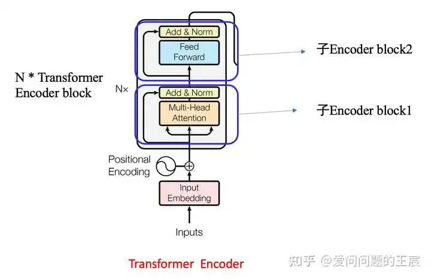

## 5. 什么是Transformer Decoder？

5.1 从功能角度，相比于Transformer Encoder，Transformer Decoder更擅长做生成式任务，尤其对于自然语言处理问题。

5.2 从结构角度，如图6所示，Transformer Decoder = Embedding + Positional Embedding + N*（子Decoder block1 + 子Decoder block2 + 子Decoder block3）+ Linear + Softmax；

子Decoder block1 = Mask Multi head attention + ADD + Norm；

子Decoder block2 = Multi head attention + ADD + Norm；

子Decoder block3 = Feed Forward + ADD + Norm；

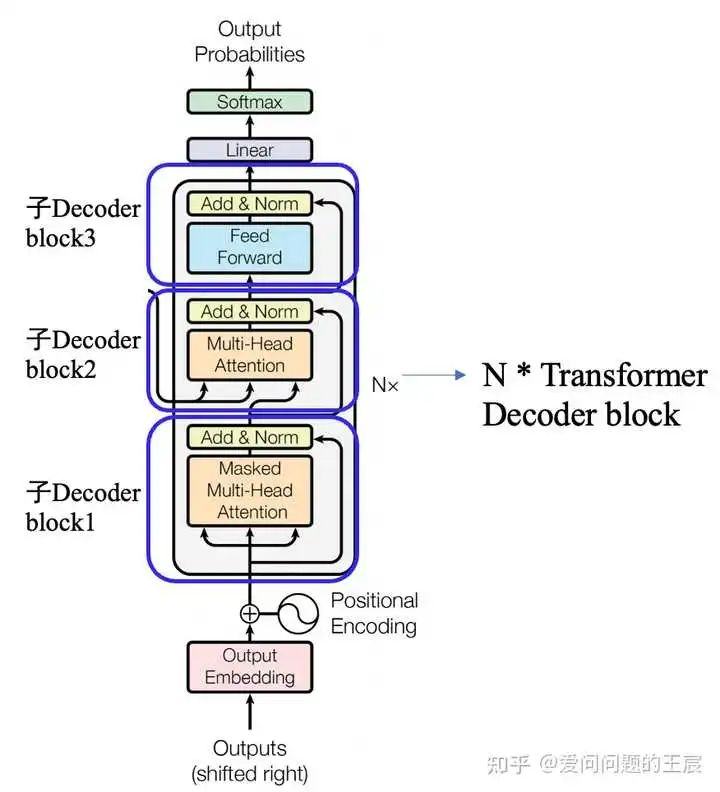

5.3 从（Embedding+Positional Embedding）（N个Decoder block）（Linear + softmax) 这三个每一个单独作用角度：

Embedding + Positional Embedding ：以机器翻译为例，输入“Machine Learning”，输出“机器学习”；这里的Embedding是把“机器学习”也转化成向量的形式。

N个Decoder block：特征处理和传递过程。

Linear + softmax：softmax是预测下一个词出现的概率，如图7所示，前面的Linear层类似于分类网络（ResNet18）最后分类层前接的MLP层。

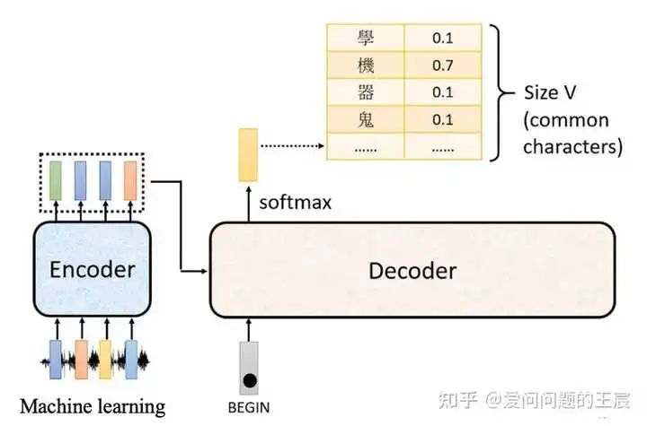

5.4 Transformer Decoder的输入、输出是什么？在Train和Test时是不同的。

在Train阶段，如图8所示。这时是知道label的，decoder的第一个输入是begin字符，输出第一个向量与label中第一个字符使用cross entropy loss。Decoder的第二个输入是第一个向量的label，Decoder的第N个输入对应的输出是End字符，到此结束。这里也可以看到，在Train阶段是可以进行并行训练的。

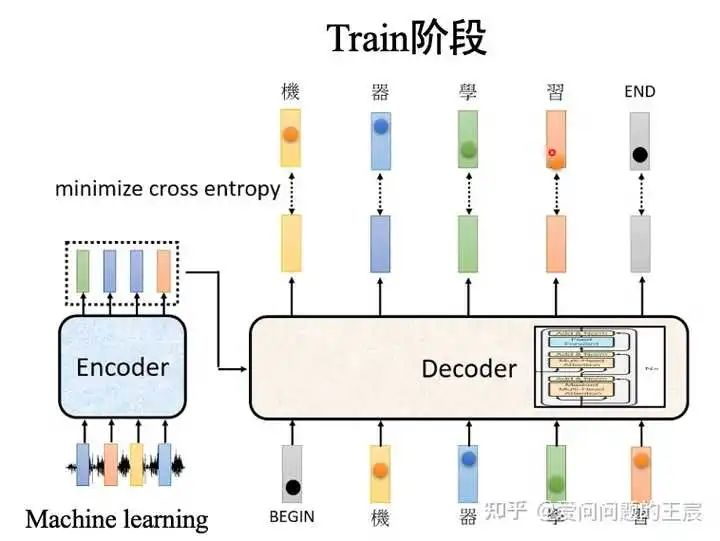

在Test阶段，下一个时刻的输入时是前一个时刻的输出，如图9所示。因此，Train和Test时候，Decoder的输入会出现Mismatch，在Test时候确实有可能会出现一步错，步步错的情况。有两种解决方案：一种是train时偶尔给一些错误，另一种是Scheduled sampling。

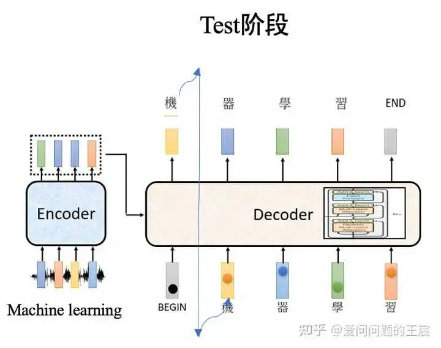

5.5 Transformer Decoder block内部的输出和输出是什么？

前面提到的是在整体train和test阶段，Decoder的输出和输出，那么Transformer Decoder内部的Transformer Decoder block，如图10所示，的输入输出又是什么呢？

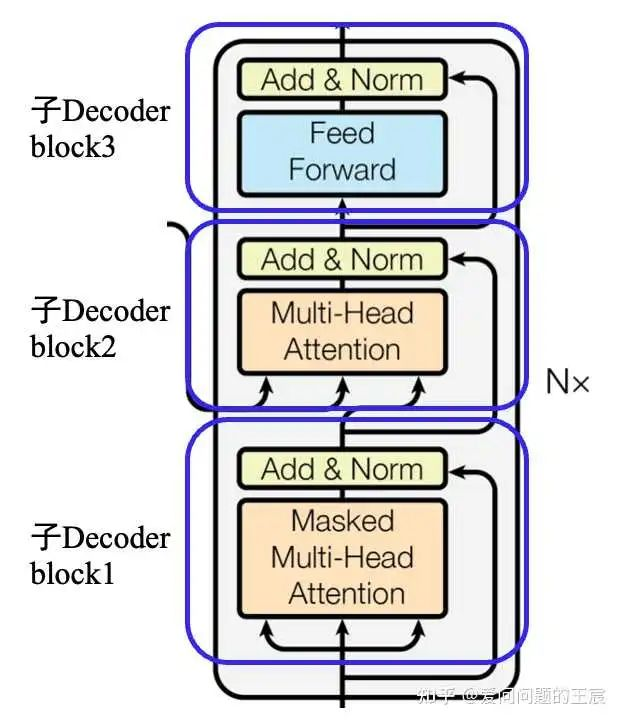

对于N=6中的第1次循环（N=1时）：子Decoder block1 的输入是 embedding +Positional Embedding，子Decoder block2 的输入的Q来自子Decoder block1的输出，KV来自Transformer Encoder最后一层的输出。

对于N=6的第2次循环：子Decoder block1的输入是N=1时，子Decoder block3的输出，KV同样来自Transformer Encoder的最后一层的输出。

总的来说，可以看到，无论在Train还是Test时，Transformer Decoder的输入不仅来自（ground truth或者上一个时刻Decoder的输出），还来自Transformer Encoder的最后一层。

训练时：第i个decoder的输入 = encoder输出 + ground truth embedding。

预测时：第i个decoder的输入 = encoder输出 + 第(i-1)个decoder输出.

## 6. Transformer Encoder和Transformer Decoder有哪些不同？

6.1 作用上，Transformer Encoder常用来提取特征，Transformer Decoder常用于生成式任务。Transformer Encoder和Transformer Decoder是两条不同的技术路线，Bert采用的前者，GPT系列模型采用的是后者。

6.2 结构上，Transformer Decoder block包括了3个子Decoder block，而Transformer Encoder block 包括2个子Encoder block，且Transformer Decoder中使用了Mask multi-head Attention。

6.3 从二者的输入输出角度，N个Transformer Encoder运算完成之后，它的输出才正式输入进Transformer Decoder，作为QKV中的K和V，给Transformer Decoder使用。那么TransformerEncoder最后层的输出是如何送给Decoder呢？如图11所示。

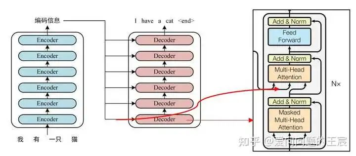

那么，为什么Encoder和Decoder必须要用这种交互的方式呢？其实也并不一定，后续有不同交互方式的提出，如图12。

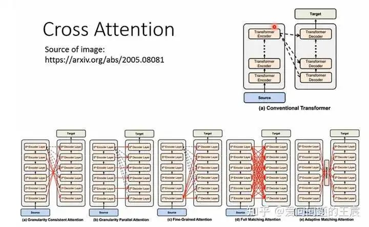

## 7. 什么是Embedding？

7.1 Embedding在Transformer架构中的位置如图13所示。

7.2 提出背景： 计算机无法直接处理一个单词或者一个汉字，需要把一个token转化成计算机可以识别的向量，这也就是embedding过程。

7.3 实现方式： 最简单的embedding操作就是one hot vector，但one hot vector有一个弊端就是没有考虑词语前后之间的关系，后来也就产生了WordEmbedding，如图13。

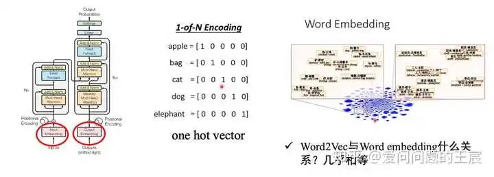

## 8. 什么是Positional Embedding？

8.1 Positional Embedding在Transformer架构中的位置如图14所示。

8.2 提出背景： RNN作为特征提取器，是自带词的前后顺序信息的；而Attention机制并没有考虑先后顺序信息，但前后顺序信息对语义影响很大，因此需要通过Positional Embedding这种方式把前后位置信息加在输入的Embedding上。

8.3 实现方式： 传统位置编码和神经网络自动训练得到。

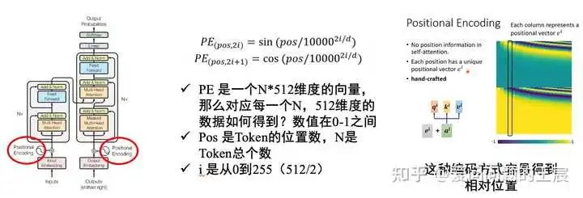

## 9. 什么是Attention？

9.1 介绍Transformer，为什么要介绍Attention呢？因为在Transformer中最多的multi head attention和Mask multi head attention来自Scaled dot product attention，而scaled dot product attention来自self attention，而self attention是attention的一种，因此首先需要了解Attention，如图15所示。

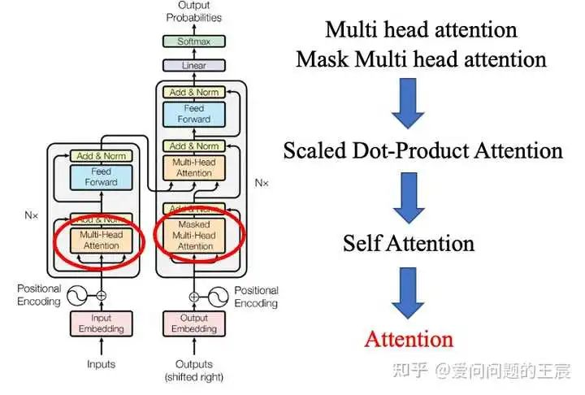

9.2 Attention到底是什么意思呢？

对于图像而言，attention就是人们看到图像中的核心关注的区域，是图像中的重点，如图16所示。对于序列而言，Attention机制本质上是为了找到输入中不同token之间的相互关系，通过权重矩阵来自发地找到词与词之间的关系。

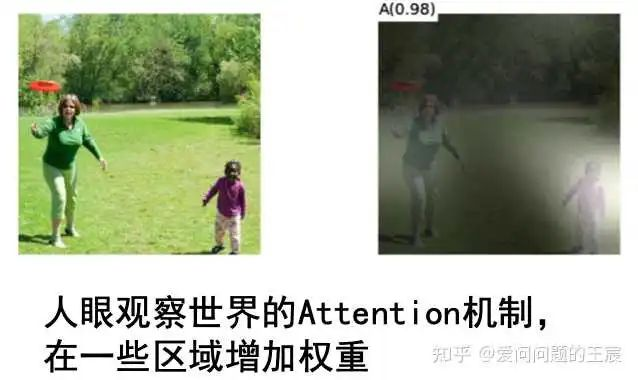

9.3 Attention是如何实现的呢？

是通过QKV实现的。

那么什么是QKV呢？Q是query，K是keys，V是values。如图17所示，举例而言，Q是大脑发出的信号，我口渴了；K是环境信息，眼睛看到的世界；V是对环境中不同的物品赋予不同的比重，水的比重加大。

总之，Attention就是通过计算QK的相似度，与V相乘得到注意力数值。

$$\text{Attention}(\mathrm{Query},\mathrm{Source})=\sum\text{Similarity}(\mathrm{Query},\mathrm{Key}_\mathrm{i})*\mathrm{Value}_\mathrm{i}$$

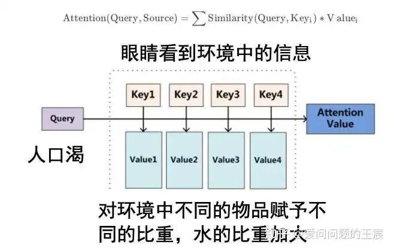

9.4 为什么必须要有QKV三者？

为什么不是只有Q？因为Q1与Q2之间的关系权重，不止需要a12，也需要a21。你可能会问？我们让a12=a21不行吗？也可以尝试，但从原理上讲效果应该没有a12和a21效果好。

为什么不是只有QK？求得的权重系数需要放到输入中，可以乘Q，也可以乘K，为什么要重新乘V呢？我觉得可能是多了一组可训练参数WV，使网络具有更强的学习能力。

## 10. 什么是Self attention？

10.1 介绍Transformer，为什么要介绍self Attention呢？因为在Transformer中最多的multi head attention和Mask multi head attention来自Scaled dot product attention，而scaled dot product attention来自self attention，如图15所示。

10.2 什么是self attention呢？self attention和local attention、stride attention都是attention的一种；self attention是每一个Q与每一个K依次计算注意力系数，如图18所示，而像local attention是Q只与相邻的K计算注意力系数，stride attention是Q通过跳连的方式与K计算注意力系数。

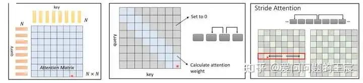

10.3 Self attention为什么可以用于处理像机器翻译这种序列数据?

输入序列中的每一个位置的数据，可以关注其他位置的信息，由此通过Attention score来提取特征或者捕获输入序列每一个token之间的关系。

10.4 Self attention是如何具体实现的? 总共分为4步，如图19所示

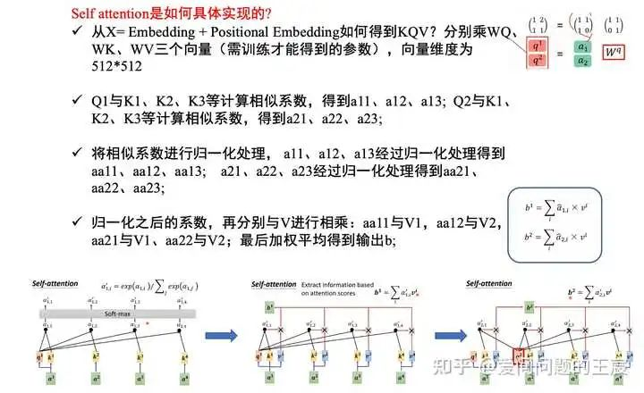

## 11. 什么是Scaled dot product attention？

11.1 self attention最常见的有两种，一种是dot product attention、另一种是additive attention，如图20所示，前者的计算效率更高。

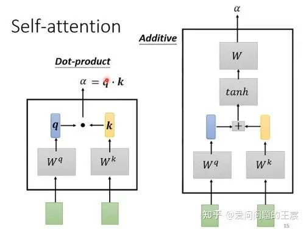

11.2 什么是Scaled ?

scaled的具体实现方式如图21所示，这一操作的目的是为了防止内积过大，从梯度角度考虑，避免靠近1，易训练；与batch normalization有一些相似的功能。

$$\text{Attention}(Q,K,V)=\text{softmax}(\frac{QK^T}{\sqrt{d_k}})V$$

## 12. 什么是Multi head attention？

12.1 Multi head attention在Transformer架构中的位置如图15所示。

12.2 提出背景：CNN具有多个channel，可以提取图像不同维度的特征信息，那么Self attention是否可以有类似操作，可以提取不同距离token的多个维度信息呢？

12.3 什么是group 卷积？如图22所示，将输入的特征多个channel分成几个group单独做卷积，最后再进行con c操作。

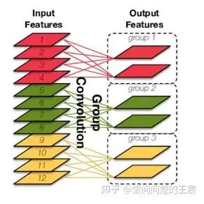

12.4 Multi head attention的实现方式？与self attention根本不同是什么？

如图23所示，以2个head的为例，将输入的Q、K、V分成两份，每一小份的Q与对应的K、V分别操作，最后计算得到的向量再进行conc操作，由此可以看出，Multi head attention与group卷积有着相似的实现方式。

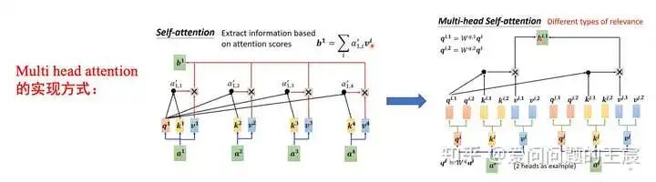

12.5 如何从输入输出维度，角度来理解Multi head attention？如图24所示。

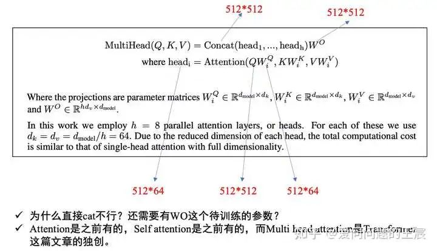

## 13. 什么是Mask Multi head attention？

13.1 Mask Multi head attention在transformer架构中的位置如图15所示。

13.2 为什么要有Mask这种操作？

Transformer预测第T个时刻的输出，不能看到T时刻之后的那些输入，从而保证训练和预测一致。

通过 Masked 操作可以防止第 i 个单词知道 i+1 个单词之后的信息，如图25所示。

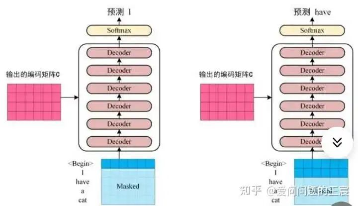

13.3 Mask操作是如何具体实现的呢？

Q1只跟K1计算，Q2只跟K1、K2计算，而对于K3、K4等，在softmax之前给一个非常大的负数，由此经过softmax之后变为0，其在矩阵上的计算原理实现如图26所示。

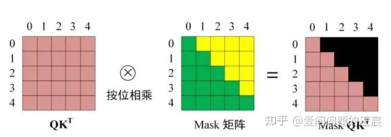

## 14. 什么是ADD？

14.1 Add就是残差连接，由2015年ResNet这篇文章发扬光大（目前引用量已超过16万），与Skip connection的区别在于需要大小维度全部相同。

14.2 作为大道至简想法的极致，几乎每一个深度学习模型都会用到这个技术，可以防止网络退化，常用于解决多层网络难训练的问题。

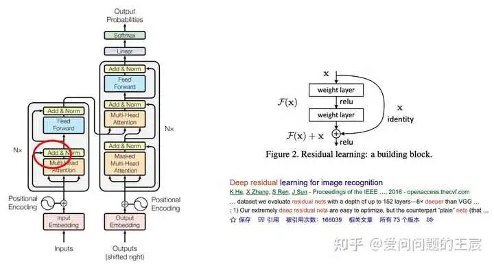

## 15. 什么是Norm？

15.1 Norm就是layer normalization。

15.2 核心作用：为了训练更加稳定，和batch normalization有相同的作用，都是为了使输入的样本均值为零，方差为1。

15.3 为什么不使用batch normalization，使用的是layer normalization呢？因为一个时序数据，句子输入长度有长有短，如果使用batch normalization，则很容易造成因样本长短不一造成“训练不稳定”。BN是对同一个batch内的所有数据的同一个特征数据进行操作；而LN是对同一个样本进行操作。

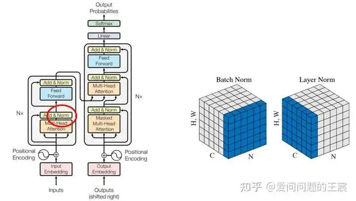

16. 什么是FFN？

16.1 FFN就是feed forward networks。

16.2 为什么有了Self attention层，还要有FFN？Attention已经有了想要的序列信息特征，MLP的作用是把信息投影到特定的空间里，再做一次非线性映射，和Self attention交替使用。

16.3 结构上：包括两层MLP，第一层的维度为512*2048，第二层的维度为2048*512，且第二层MLP没有使用激活函数，如图29所示。

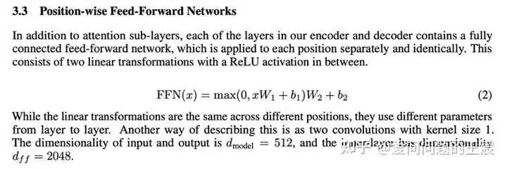

## 17. Transformer是如何训练出来的？

17.1 数据上，在Transformer论文中有提到，用到了4.5M和36M的翻译句子对。

17.2 硬件上，base模型是8个P100 GPU训练了12个小时，大模型是训练了3.5天。

17.3 模型参数和调参层面：

第一，可训练的参数包括WQ、WK、WV、WO，换包括FFN层的参数。

第二，可调的参数包括：每一个token向量表示的维度（d_model）、head的头数、Encoder和Decoder中block重复的次数N、FFN中间层向量的维度、Label smoothing（置信度0.1）和dropout（0.1）。

## 18. Transformer为什么效果好？

18.1 虽然题目是Attention is all you need，但后续一些研究表明，Attention、残差连接、layer normalization、FFN，这些因素共同成就了Transformer。

18.2 Transformer优点包括：

第一，提出深度学习既MLP、CNN、RNN后的第4大特征提取器。

第二，一开始用在机器翻译，随着GPT和Bert彻底出圈；是一个转折点，在这个点之后，NLP领域快速发展，之后多模态、大模型、视觉Transformer等开始兴起。

第三，给人们信心，原来CNN和RNN之后，还可以有效果更好的特征提取器。

18.3 Transformer的不足之处？

第一，计算量大，对硬件要求高。

第二，因为无归纳偏置，需要很多数据才可以取得很好的效果。

ref: 
[1]. https://mp.weixin.qq.com/s/sNyh3SzhIdsk8feYfQlTSA

---

> 作者: [Jian YE](https://github.com/jianye0428)  
> URL: https://jianye0428.github.io/posts/transformerqanda/  

