# 变分自编码器 VAE 详解

<!-- 
note abstract info tip success question warning failure danger bug example quote
 -->

<!--more-->

## 引入
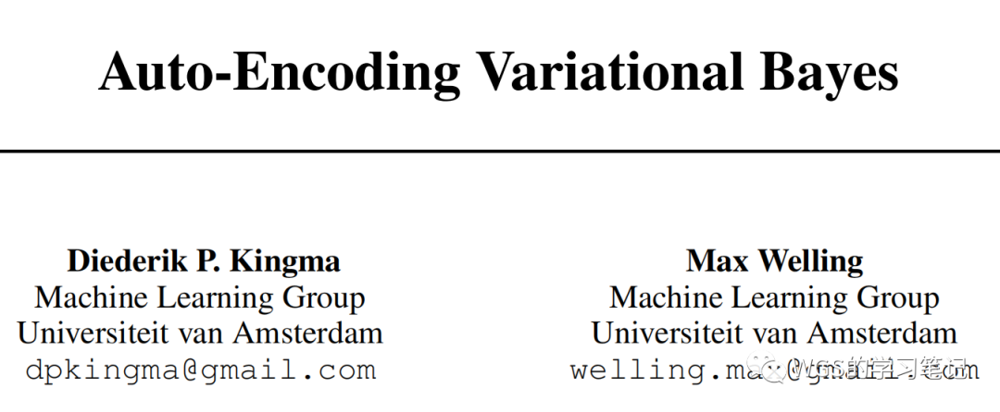


本文也是为写 Stable Diffusion 相关文章做的铺垫，主要参考了李宏毅老师的视频课以及B站的白板推导系列。有关GMM、蒙特卡洛、ELBO、变分推断、重参数化的细节本文不做详细介绍，主要围绕VAE的结构以及loss优化推导做讲解。


我们先来简单的引入一下：

- V：变分推断，它的意思来自于概率图模型，本文会给出变分下界的详细推导；
- AE：Auto-Encoder，自编码器；
- VAE：Variational Auto-Encoder，**变分自编码器**，将概率图模型和神经网络相结合的模型；

## 一、AE
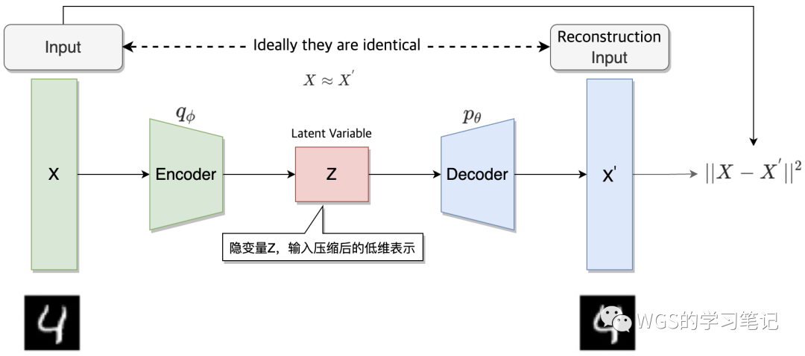

先来介绍一下自编码器(Auto-Encoder)，它是一种无监督学习方法，如上图所示，原理可概述为：

- 将高维原始数据(如图片)送入 Encoder，利用 Encoder 将高维数据映射到一个低维空间，将n维压缩到m维($m<<n$)，我们用隐变量来表示；
- 然后将低维空间的特征送入 Decoder 进行解码，以此来重建原始输入数据。


Encoder、Decoder网络可以为普通的全连接、也可以为CNN、或者类似于Unet都可以，没有固定的要求。


这里为和后文的推导联系起来，我们将 Encoder 网络的映射函数定义为 $q_{\phi}$ 、Decoder 网络定义为 $p_{\theta}$，其中 $\phi$、$\theta$ 皆为网络参数。 
那么对于输入 $x$，我们可以通过Encoder得到 `Latent Variable`：$z = q_{\phi}(x)$，然后Decoder可以从隐变量z中对原始数据进行重建：$x' = p_{\theta}(z) = p_{\theta}(q_{\phi}(x))$。

我们希望重建的数据和原来的数据近似一致，即最小化输入和输出之间的重构误差，那么AE的训练损失可以采用简单的MSE：

$$L_{\text{AE}}(\theta, \phi) = \frac{1}{n}\sum_{i=1}^{n} (x^{(i)} - x'^{(i)})^2 =\frac{1}{n}\sum_{i=1}^{n} (x^{(i)} - p_{\theta}(q_{\phi}(x^{(i)})))^2$$


可以理解为比较输入和重构输入的像素点的误差。


## 二、AE 存在的问题

上面我们通过AE可以**构建一个重构图像的模型**，但是这个模型并不能满足要求，或者说它并不是真正意义上的生成模型。对于一个生成模型而言，它满足：

- **Encoder 和 Decoder 可以独立拆分(类比 GAN 的 Generator 和 Discriminator)；**
- **固定维度下任意采样出来的编码，都应该能通过 Decoder 产生一张清晰且逼真的图片。**

当然对于第一点它是满足的，我们主要分析第二点，也就是AE存在的问题，从而引出VAE。

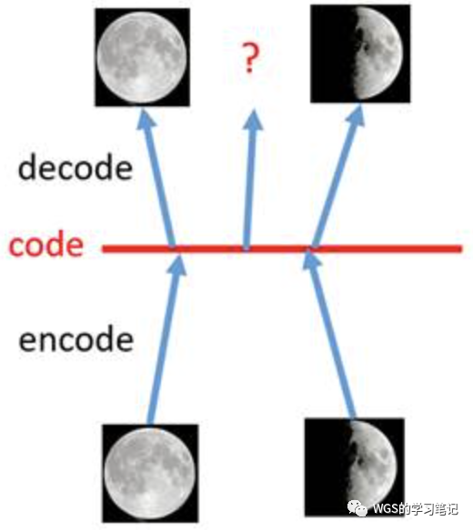

如上图所示，用一张全月图和一张半月图去训练一个AE，经过训练模型是能够很好的还原出这两张图片。

接下来，我们在 latent code 中任取一点，将其交给 Decoder 进行解码，直觉上我们会得到一张介于全月和半月之前的图片(比如阴影面积覆盖的样子)。然而实际上的输出图片不仅模糊而且还是乱码的。

对于这个现象，一个直观的解释就是AE的 Encoder 和 Decoder 都用了DNN，那么NN只会干一件事情：学习、记住、用记住的东西预测，我们<u>从 latent space 中采样的点，编码器都没有学习过</u>，怎么能够指望它生成希望的值呢?

换句话说，**NN只记住了左边全月图片的隐向量和右边半月图片的隐向量，并不能泛化到中间就是$\frac{3}{4}$月亮的图片**。

为了解决这个问题，一个最直接的思想就是**引入噪声**，扩大图片的编码区域，从而能够覆盖到失真的空白编码区，如下图所示：

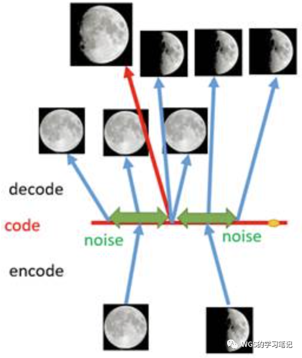

其实说白了就是**通过增加输入的多样性从而增强输出的鲁棒性**。

当我们给输入图片进行编码之前引入一点噪声，使得每张图片的编码点出现在绿色箭头范围内，这样一来所得到的 latent space 就能覆盖到更多的编码点。此时我们再从中间点抽取还原便可以得到一个比较希望的输出。

虽然我们给输入的图片增加了一些噪声，使得 latent space 能够覆盖到比较多的区域，但是还有不少地方没有覆盖到，比如上图的黄色点位置。

因此，我们是不是可以尝试利用更多的噪声，使得对于每一个输入样本，它的编码都能够覆盖到整个编码空间？只不过我们这里需要保证的是：对于编码附近的我们应该给定一个高的概率值，对于距离原编码点远的应该给定一个低的概率值。

这样总体来说，我们就是要将原先的一个单点拉伸到整个编码空间，即将离散的编码点拉伸为一条连续的接近正太分布的编码曲线，如下图所示：

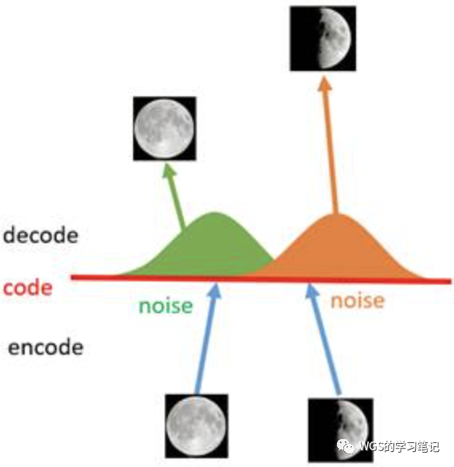

这个其实就是VAE的思想，熟悉GMM的同学应该知道，它是K个高斯分布(Gaussian Distribution)的混合，其实**VAE可以说是无限个高斯分布的混合**。

## 三、VAE 结构预览

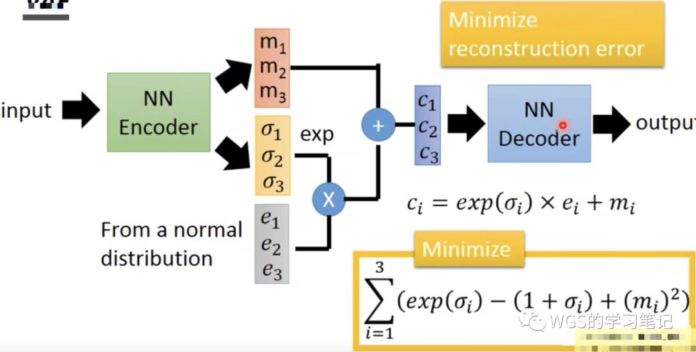

如上图所示VAE的结构，我们可以看到**VAE里的编码器不是输出隐向量$z$，而是一个概率分布**，分布的均值为$m$、方差为$\sigma$，$e$ 即为给编码添加的噪声，来自于正态分布。


VAE的Encoder的输出不是隐向量，而是均值为$m$, 方差为$\sigma$的正态分布。


公式怎么得到的后面会给出推导，我们先来描述一下这个过程：

$$z_{i} = c_{i} = \exp(\sigma_i) * e_i + m_i$$

 - $e$ 为噪声，$m$ 为均值， $\sigma$ 为控制噪声$e$的方差;
 - Encoder会计算出两组编码，一组为均值m、一组为控制噪声干扰程度的方差$\sigma$;
 - 方差$\sigma$主要用来为噪声编码 $e$ 分配权重;
 - 取指数主要是为了保证分配到的权重是正值;
 - 也就是说数据分布会在 $\exp(\sigma_i) * e$ 方差范围内采样一个值，得到一个偏移量，就是相当于把原始的样本加上了一个噪声。从结构图中我们可以看到，损失除了AE的 重构损失(reconstruction error)外，还多出了下面这一项:
   $$c = (c_1, c_2, c_3) = \sum_{i=1}^{3} (e^{\sigma_i} - (1 + \sigma_i) + (m_i)^2)$$

这个辅助loss可以认为是一个约束，也就是说生成的 $\sigma$ 要满足这个约束。

**为什么要加这个辅助loss？**

 - 我们最小化了 reconstruction error，如果不加这个辅助loss的话，Encoder肯定希望噪声对自身生成的图片干扰越小越好，为了保证生成图片的质量，于是分配给噪声的权重也就是越低。如果不加这个约束的话，网络只需要将方差设置为接近负无穷大的值 $\exp ^ {-\infty} = 0$，即可消除噪声带来的影响，这样必然会过拟合导致鲁棒性不佳。


添加辅助loss是为了防止过拟合，提高模型的鲁棒性。


**为什么加这个辅助loss有用？**

 - 我们对 $\sigma$ 求导可得 $c = e^{\sigma} - 1$，令其等于0可求出 $\sigma = 0$ 时取得极小值，这样一来便可以约束方差不会一路走向负无穷，从而起到正则化约束的作用；
 - 如下图所示，$e^{\sigma}$ 是蓝色曲线，$1 + \sigma$ 是红色线条，那么 $e^{\sigma} - (1 + \sigma)$就是蓝色曲线减去红色直线，得到绿色曲线，显而易见的可以发现它的最小值为0。

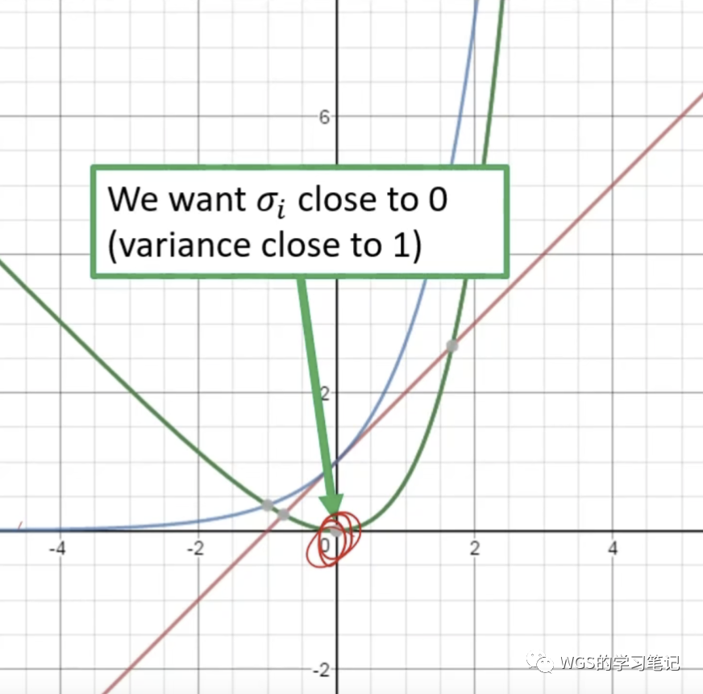

## 四、数学描述

### 4.1、作者的 Intuition
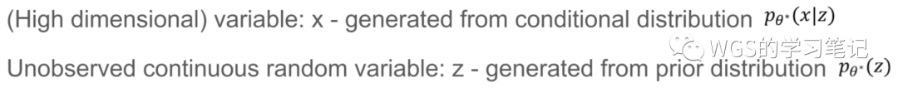
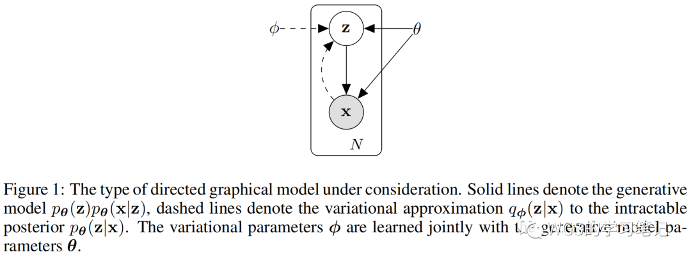

借用作者原文的表述，我们来引入定义。如上图所示，首先我们会有一个高维的随机变量，与之相关联的我们叫它隐变量 $z$，$z$ 的维度一般要比 $x$ 低很多，用来描述 $x$ 中所包含的信息。

我们假设 $z$ 满足分布 $p_{\theta}(z)$，$x$ 也是一个条件概率，也就是说：
 - 在已知 $z$ 的情况下，$p_{\theta}(z)$能生成一个sample $x$ ；
 - 给定一个sample $x$，$q_{\phi}(x)$ 就可以尝试推测出这个来。


因为假设$z$满足一定分布，所以也有从$\theta$到$z$的箭头；

之后提到的$z$都是Decoder里的参数。


这么说可能有点抽象，我们举个例子：

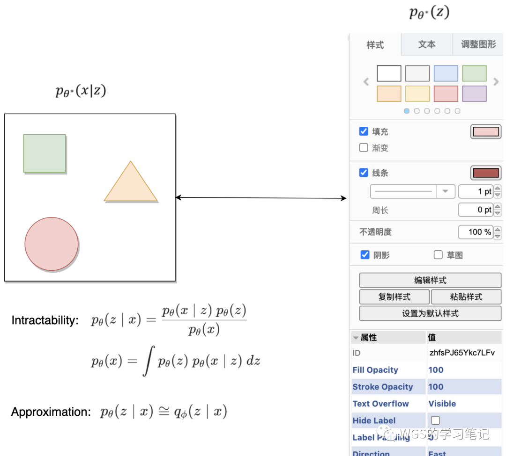

如上图所示，假设有一个图像，里面有3个颜色不一致的形状，这个就是我们的输入$x$。通过右图的参数，可以控制$x$，这就是隐变量$z$。

那么回到实际的应用场景，我们想要通过$x$获得$z$，又想通过$z$得到相应的$x$，也就是图中的双箭头就是我们想要做的事情。

那么对于生成模型而言，VAE的数据产生包括两个过程：
- 从一个先验分布 $p_{\theta}(z)$ 中采样一个 $z^{(i)}$；
- 根据条件分布 $p_{\theta}(x|z)$，用 $z^{(i)}$ 生成 $x^{(i)}$。

我们希望找到一个参数 $\theta^*$ 来**最大化生成真实数据的概率**：

$$\theta^*=\argmax_{\theta} \prod_{i=1}^{n}p_{\theta}(x^{(i)})$$

这里 $p_{\theta}(x^{(i)})$ 可以通过对 $z$ 积分得到：

$$p_{\theta}(x^{(i)}) = \int_{z} p_{\theta}(x, z) \mathrm{d}{z} = \int_{z} p_{\theta}(z) p_{\theta}(x^{(i)}|z)\mathrm{d}{z}$$

实际上我们要根据上述积分是不可能实现的，先验分布 $p_{\theta}(z)$ 是未知的，而且如果分布比较复杂且高维，对其穷举计算也是不现实的。

**变分推断引入后验概率来联合建模**，即given $x$ 想要得到它的 $z$，根据贝叶斯公式表示为：

$$p_{\theta}(z | x) = \frac{p_{\theta}(x|z) p_{\theta}(z)}{p_{\theta}(x)}$$

我们又回到最上面的图：

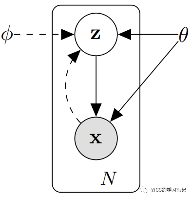

 - 实线箭头就是我们要得到的生成模型 $p_{\theta}(z) p_{\theta}(x|z)$，这里 $p_{\theta} (z)$ 往往是事先定义好的，比如标准正态分布，而 $p_{\theta}(x|z)$ 可以用一个网络来学习，它就可以看成是 **Probabilistic Decoder**。
 - 虚线箭头代表对后验分布 $p_{\theta}(z|x)$ 的变分估计，它也可以用一个网络去近似，我们记为 $q_{\phi}(z|x)$，则这个网络称为 **Probabilistic Encoder**。

所以VAE的优化目标就有了，为了**达到从x估计z的过程**，对于估计的后验 $q_{\phi}(z|x)$，我们希望它**接近**真实的后验分布 $p_{\theta}(z|x)$ ，即：

$$p_{\theta}(z|x) \cong q_{\phi}(z|x)$$

说白了就是使用另一个模型，参数由 $\phi$ 表示，在参数 $\phi$ 的帮助下，有了一个分布 $q$ ，现在希望分布 $q$ 能够尽量接近 $p$，从而达到从 $x$ 估计 $z$ 的过程。


可以看到VAE和AE架构上还是相似的，VAE的最终目标是得到生成模型即Decoder，Encoder只是辅助建模。

而AE常常是为了得到Encoder来进行特征提取或压缩。


### 4.2、变分下界

为了衡量两个 distribution 的相似程度，我们应该很自然的想到了KL divergence，因为我们实际上计算的是分布 $q$ ，所以我们从 $q$ 的视角来计算它到 $p$ 的KL散度：

$$q_{\phi}(z|x) \cong p_{\theta}(z|x) \rightarrow D_{\text{KL}}(q_{\phi}(z|x) || p_{\theta}(z|x))$$


需要再次强调的是：

$\theta$ 为 decoder 的参数；

$\phi$ 为 encoder 的参数。


根据定义我们将KL divergence展开，对 $z$ 求和，表示如下：

$$
\begin{align}
D_{\text{KL}}(q_{\phi}(z|x) || p_{\theta}(z|x)) &= \sum_{z} q_{\phi}(z | x) \log (\frac{q_{\phi}(z | x)}{p_{\theta}(z | x)}) \cr
    &= - \sum_{z} q_{\phi}(z | x) \log (\frac{p_{\theta}(z | x)}{q_{\phi}(z | x)})\cr
    &= - \sum_{z} q_{\phi}(z | x) \log (\frac{\frac{p_{\theta}(z,x)}{p_{\theta}(x)}}{q_{\phi}(z | x)})\cr
    &= - \sum_{z} q_{\phi}(z | x) [\log({\frac{p_{\theta}(x, z)}{p_{\theta}(x)}}) - \log({q_{\phi}(z | x)})]\cr
    &= - \sum_{z} q_{\phi}(z | x) [\log({\frac{p_{\theta}(x, z)}{q_{\phi}(z|x)}}) - \log({p_{\theta}(x)})]\cr
\end{align}
$$


$p_{\theta}(z | x)$ 是根据条件概率公式拆开的。


这个时候我们注意到 $\log(p_{\theta}(x))$ 是和 $z$ 没有关系的，并且log项是常数，所以在乘求和的时候直接提到 $\sum$ 外面去就可以了，并且 $q_{\phi} (z | x)$ 对 $z$ 求和的结果是1，那所以 $-\sum_{z}(q_{\phi}(z|x))(-\log(p_{\theta}(x)))$ 的结果就是 $\log(p_{\theta}(x))$，它是个const。

我们将它移到等式的左边，表示如下：

$$
\begin{align}
\log(p_{\theta}(x)) &= D_{KL}(q_{\phi}(z|x) || p_{\theta}(z|x)) + \sum_{z}q_{\phi}(z|x)\log(\frac{p_{\theta}(x, z)}{q_{\phi}(z|x)}) \cr
&= D_{KL}(q_{\phi}(z|x) || p_{\theta}(z|x)) + L(\theta, \phi; x)
\end{align}
$$

我们将 $\sum_{z}q_{\phi}(z|x)\log(\frac{p_{\theta}(x, z)}{q_{\phi}(z|x)})$ 写成 $L(\theta, \phi; x)$ ，等式左边是一个const，也就是说不管 $x$ 的分布是什么样，它对 $\theta$ 来说没什么影响。等式右边，KL divergence是一个非负的，所以我们只要把 $L(\theta, \phi; x)$ 的值尽可能的拉大，那么KL divergence的值就会随之缩小。

**想要最大化的$L(\theta, \phi; x)$，就被称为变分下界(Variational lower bound)。**

### 4.3、Loss Function
现在我们只要想办法将这个 lower bound 提升就可以了，那么这个 lower bound 就可以作为我们的 loss function：

$$
\begin{aligned}
L(\theta, \phi; x) &= \sum_{z}q_{\phi}(z|x)\log(\frac{p_{\theta}(x, z)}{q_{\phi}(z|x)}) \cr
&= \sum_{z}q_{\phi}(z|x)\log(\frac{p_{\theta}(x|z) p_{\theta}(z)}{q_{\phi}(z|x)}) \cr
&= \sum_{z}q_{\phi}(z|x)[\log(p_{\theta}(x|z)) + \log(\frac{p_{\theta}(z)}{q_{\phi}(z | x)})] \cr
&= {E}_{q_{\phi}(z|x)}[\log(p_{\theta}(x|z))] - D_{KL}(q_{\theta}(z | x) || p_{\theta}(z))
\end{aligned}
$$

上述等式，我们将 lower bound 再展开，将 $p_{\theta}(x, z)$ 展成条件概率，然后再将log拆分。

第三行中括号内，左边的可以写成期望的形式，右边的因为都有 $q_{\phi}$ 和 $p_{\theta}$ 所以符合KL divergence的公式。

- 我们将 ${E}_{q_{\phi}(z|x)}[\log(p_{\theta}(x|z))]$ 称为**Reconstruction Loss**，
- 将 $-D_{KL}(q_{\theta}(z | x) || p_{\theta}(z))$ 称为 **Regularization Loss**。

所以我们只需要估计出这两项的梯度来，就可以对 lower bound 进行优化了。


我们的目的是想让 Probabilistic Encoder 接近于 $p_{\theta}(z)$，因为两个损失，这样KL divergence就越大越好，实际-KL才是训练用的loss。


### 4.4、蒙特卡洛法求梯度
接下来讲如何求出这两项的导数，来优化提升 lower bound。我们看到想要优化的这个loss，其实是可以写成期望的形式的，假定期望里的这一项是 $f(z)$，对于估计这种期望它的导数，最直接的我们就想到了蒙特卡洛的方法。

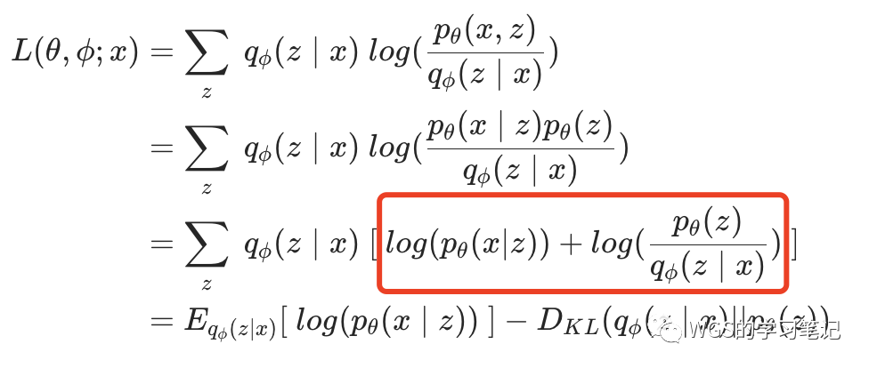


虽然这里有个 $\phi$，但我们假定这个 $f(z)$ 和 $\phi$ 是没有关系的。(假设！！！！)


使用蒙特卡洛方法，对 $f(z)$ 在 $q_{\phi}$ 上的期望，对 $\phi$ 求导数，表示如下：

$$
\begin{aligned}
\eta &= \triangle_{\phi} E_{q_{\phi}(z)}[f(z)]\cr
     &= \triangle_{\phi} \int {q_{\phi}(z)}f(z) \mathrm{d}z\cr
     &= \int \triangle_{\phi}{q_{\phi}(z)}f(z) \mathrm{d}z\cr
     &= \int {q_{\phi}(z)}f(z)\triangle_{\phi} \log {q_{\phi}(z)}\mathrm{d}z\cr
     &= E_{q_{\phi}(z)}[f(z)\triangle_{\phi} \log {q_{\phi}(z)}]
\end{aligned}
$$

- $line 1 \sim 2:$ 根据期望的定义展开，因为我们假设 $f(z)$ 和 $\phi$ 没有关系，所以可以将导数符号拿进来；
- $line 3: $ 根据变换 $\triangle_{\phi} \log q_{\phi}(z) = \frac{\triangle_{\phi}q_{\phi}(z)}{q_{\phi}(z)}$ 带入可得;

套用蒙特卡洛公式，最终表示如下：

$$
\begin{aligned}
\triangle_{\phi}E_{q_{\phi}(z)}[f(z)] &= E_{q_{\phi}(z)}[f(z) \triangle_{q_{\phi}(z)} \log{q_{\phi}(z)}] \cr
&\cong \frac{1}{L}\sum_{l=1}^{L} f(z) \triangle_{q_{\phi}(z^{(l)})} \log{q_{\phi}(z^{(l)})}, where z^{(l)} \sim q_{\phi}(z|x^{(i)})
\end{aligned}
$$

但是作者实验发现使用这个 estimator 是有很高的 variance 的，就是直观上来说会导致训练很不稳定。

在此基础上作者提出了 Generic Stochastic Gradient Variational Bayes (**SGVB**) estimator，并使用**重参数化(Reparameterization)**trick，我们先来说下重参数化。

### 4.5、重参数化 Trick

上面我们用蒙特卡洛的时候，有一个非常强的假设，那就是假设 $f(z)$ 和 $\phi$ 是没有关系的，但实际表达式中：
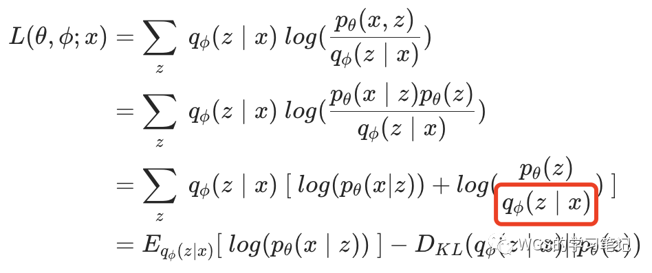

我们可以看到它还是有关系的，所以我们得考虑它们之间存在的关系、这个关系会带来什么样的问题。

我们把它打开来看：

$$
\begin{aligned}
\triangle_{\phi}E_{q_{\phi}}[f(z)] &= \triangle_{\phi}\int q_{\phi}(z)f(z) \mathrm{d}z \cr
&= \int \triangle_{\phi}[q_{\phi}(z)f(z)] \mathrm{d}z\cr
&= \int f(z) \triangle_{\phi}q_{\phi}(z) \mathrm{d}z + \int q_{\phi}(z)\triangle_{\phi}f(z) \mathrm{d}z\cr
&= \underbrace{\int f(z) \triangle_{\phi}q_{\phi}(z) \mathrm{d}z}_{what \ about \ this \ ?} + E_{q_{\phi}(z)}[\triangle_{\phi}f(z)]
\end{aligned}
$$

分别求导之后，后面一项可以写成期望的形式，但是前面这一项就无法处理了，为了解决这个问题，作者使用了**重参数化技巧(Reparameterization Trick)**。

核心思想就是引入一个辅助的随机变量 $\epsilon$，$\epsilon \in p(\epsilon)$，这个随机变量和其它变量没有关系，它是一个独立的随机变量，用来表示产生 $z$ 的过程中所有的随机性。也就是说抽样产生 $z$ 的过程中，所有的随机性都是由这个 $\epsilon \in p(\epsilon)$ 产生的。

这样我们就可以把 $z$ 写成这种形式： $z = g_{\phi}(\epsilon, x)$，从而可以把 $q_{\phi}(z)$ 这个概率分布转移到 $p_{\epsilon}$ 上，而 $\epsilon$ 有一个非常好的特性，那就是和 $\phi$ 是没有关系的。

这种 trick 就是重参数化，得到新的变形后重新对 $\phi$ 求导：

$$
\begin{aligned}
E_{q_{\phi(z)}}[f(z^{(i)})] &= E_{p(\epsilon)}[f(g_{\phi}(\epsilon, x^i))] \cr
\triangle_{\phi}E_{q_{\phi(z)}}[f(z^{(i)})] &= \triangle_{\phi}E_{p(\epsilon)}[f(g_{\phi}(\epsilon, x^i)]\cr
&=E_{p(\epsilon)}[\triangle_{\phi}f(g_{\phi}(\epsilon, x^i)]\cr
&\approx \frac{1}{L} \sum_{l=1}^{L} \triangle_{\phi}f(g_{\phi}(\epsilon^{(l)}, x^{(i)}))
\end{aligned}
$$

估计这个期望也是采样然后求平均得到最后的式子，这样就可以把loss的梯度给估计出来了。

以上是从数学角度来分析的重参数化技巧，这里作者给出了一个更加直观的表达：

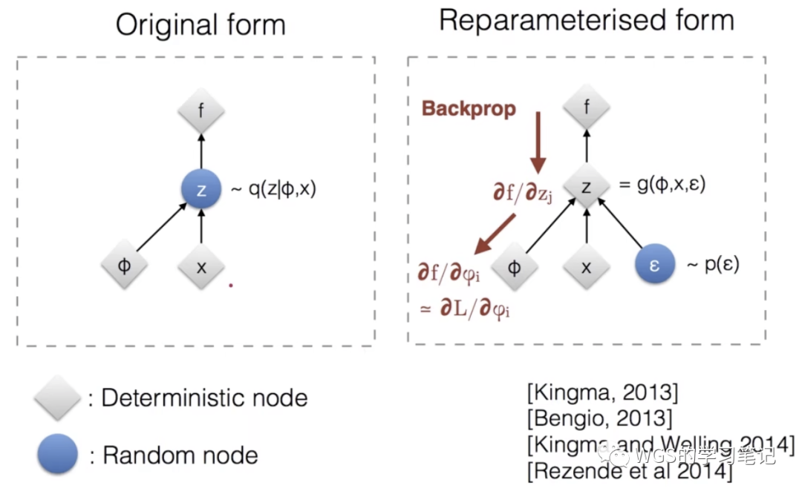

- 左图为原来的形式，我们使用 $\phi$ 和 $x$ 产生一个distribution，然后在这个distribution中抽样产生一个z，然后再得到最终的 $f$ 。但是在传递梯度的时候，怎么把梯度通过抽样这个过程传递回来呢？这个是没法传递梯度的。
在使用了重参数化trick后，随机性移动到了 $\epsilon$ 上，之前所有抽样的过程包括的随机性，都让 $\epsilon$ 包括了，这样就可以顺利地将梯度通过 $z$ 传递到 $\phi$，这是一个非常巧妙的方法.


可以理解成用多余参数逼近抽样的过程。


### 4.6 Generic SGVB

简单说完重参数化，我们回到SGVB:
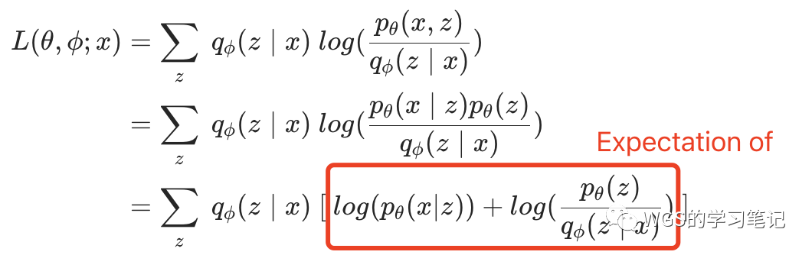

这里是想求这一串期望，它就是我们的 $f(z)$ ，根据之前的 Reparameterization Trick，我们把 $z$ 写成这样的形式：

$$z^{(i, l)} = g_{\phi} (\epsilon^{(i,l)}, x^{(i)}) \ and \ \epsilon^{(l)} \sim p(\epsilon)$$

让 $\epsilon$ 从这个 distribution 中抽样产生，$\epsilon$ 是一个与 $\phi$ 、$\theta$ 都没有关系的随机变量，然后 loss 就变成：

$$L(\theta, \phi, x^{(i)}) = \frac{1}{L} \sum_{l=1}^{L} \log p_{\theta}(x^{(i)}, z^{(i,l)}) - \log q_{\phi}(z^{(i,l)} | x^{(i)})$$

想要求它对 $\phi$ 的导数，只需要两边同时求导即可。


因为期望这个积分已经被替换成了 $\epsilon$ 的distribution，它跟 $\phi$ 是没有关系的，所以我们在估计整个loss的导数的时候，我们直接对 $\phi$ 求导就可以了。


这个就是作者提出的第一种估计梯度的方法。

### 4.7、Another SGVB

在此基础上作者还发现，有一些好的性质可以直接拿来利用，比如期望的一些性质。

在 4.3 节中我们讲到原来的 loss 可以写成 KL散度 + 期望 的形式：

$$L(\theta, \phi, x^{(i)}) = -D_{KL}(q_{\phi}(z|x^{(i)})||p_{\theta}(z)) + E_{q_{\phi}(z|x)}[\log(p_{\theta}(x^{(i)}|z))]$$

这里我们假设这两个distribution：$q_{\phi}$ 、$p_{\theta}$ 都是 Gaussian distribution，说白了就是0均值1方差，根据定义：

$$
\begin{cases}
D_{KL}(P||Q) = E_{x \sim P}[\log(\frac{P(x)}{Q(x)})]\cr
E_{x\sim P(x)} = \int P(x)Q(x)\mathrm{d}x
\end{cases}
$$

我们根据上述定义打开这个KL divergence：

$$-D_{KL}(q_{\phi}(z|x)||p_{\theta}(z)) = \int q_{\phi}(z|x)(\log p_{\theta}(z)) - \log q_{\phi}(z|x) \mathrm{d}z$$

我们先来看 $\int q_{\phi}(z|x)\log p_{\theta}(z) \mathrm{d}z$:

$$
\begin{align}
\int q_{\phi}(z|x)\log p_{\theta}(z) \mathrm{d}z &= \int N(z; \mu, \sigma^2) \log N(z; 0, 1)\mathrm{d}z\cr
&= \int N(z; \mu, \sigma^2) (-\frac{1}{2}z^2 - \frac{1}{2}\log(2\pi))\mathrm{d}z\cr
&= -\frac{1}{2} \int N(z; \mu, \sigma^2) z^2\mathrm{d}z - \frac{J}{2}\log(2\pi) \cr
&= -\frac{J}{2} \log (2\pi) - \frac{1}{2}(E_{z \sim N(z;\mu, \sigma^2)}[z]^2 + Var(z))\cr
&= -\frac{J}{2} \log (2\pi) - \frac{1}{2}\sum_{J}^{j=1}(\mu^2 + \sigma_j^2)
\end{align}
$$

- $line 1\sim 2:$ 我们让左面分布 $N(z; \mu, \sigma^2)$ 保持不动，将 normal distribution 的PDF带进去；
  - normal distribution 的PDF为:
   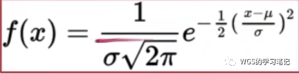
  - 将常数项直接拿出来，指数的部分也通过log直接拿下来了；
- $line 3:$ 因为 $\frac{1}{2}\log(2\pi)$ 是个常数、$N(z; \mu, \sigma^2)$ 这个分布积分之后是1，所以可以直接把常数项拿到积分外面；但是因为 $z$ 是一个向量，我们假设 $z$ 有 $J$ 个元素element，那么每个元素都会积出一个值来，所以要乘上 $J$，即 $\frac{J}{2}\log(2\pi)$;
- $line 4:$ 对于积分 $\int N(z;\mu,\sigma^2) z^2\mathrm{d}z$ 我们可以换个角度理解它：这里我们把它就当成一个概率分布，所以整个这个积分其实也是一个期望的形式，不过它是对 $z^2$ 的期望，经过变形可以写成 $-\frac{1}{2} E_{z \sim N(z; \mu, \sigma^2)}[z]^2$
。在这个基础上我们使用期望的性质 $E[z^2] = E[z]^2 + variance(z)$，即 $z^2$ 的期望等于期望的平方加上 $z$ 的方差；
- 那么对于一个 normal distribution 来说它的期望和方差是显而易见的：$\mu$ 和 $\sigma$，对于 $z$ 里的每个元素(脚标是 $j$)都加起来就好了，这样最开始的积分就可以简化成最后的形式。

我们再来看 $\int q_{\phi}(z|x)\log q_{\phi}(z|x)\mathrm{d}z$:

$$
\begin{aligned}
\int q_{\phi}(z|x)\log q_{\phi}(z|x)\mathrm{d}z &=\int N(z; \mu, \sigma^2)\log N(z;\mu,\sigma^2)\mathrm{d}z\cr
&= \int N(z; \mu, \sigma^2)(-\frac{1}{2}(\frac{z - \mu}{\sigma})^2- \frac{1}{2}\log (2 \pi) - \frac{1}{2}\log(\sigma^2))\mathrm{d}z\cr
&=-\frac{1}{2}\int N(z;\mu,\sigma^{2})(\frac{z-\mu}{\sigma})^{2}\mathrm{d}z-\frac{J}{2}log(2\pi)-\frac{1}{2}\sum_{j=1}^{J}log(\sigma_{j}^{2}) \cr
&=-\frac J2log(2\pi)-\frac12\sum_{j=1}^{J}log(\sigma_{j}^{2})-\frac12E_{z\sim N(z;\mu,\sigma^{2})}[(\frac{z-\mu}\sigma)^{2}] \cr
&=-\frac{J}{2}log(2\pi)-\frac{1}{2}\sum_{j=1}^{J}log(\sigma_{j}^{2})-\frac{1}{2}(E_{z\sim N(z;\mu,\sigma^{2})}[\frac{z-\mu}{\sigma}]^{2}+Var(\frac{z-\mu}{\sigma})) \cr
&=-\frac{J}{2}log(2\pi)-\frac{1}{2}\sum_{j=1}^{J}(1+log(\sigma_j^2))
\end{aligned}
$$

同样的还是把它的PDF带进来，展成上面相似的形式，但是这个地方的常数项和变量要显得复杂一点，相似的是我们一样可以把常数部分拿到积分外面去，然后对于前面这项积分也把它理解成期望的形式，同样利用期望的性质将平方化简，就可以得到最后的结果。

随后我们把 KL散度 这两项给合并起来：
$$
\begin{aligned}
-D_{KL}(q_{\phi}(z\mid x)\mid\mid p_{\theta}(z))& =\int q_\phi(z\mid x)(logp_\theta(z))-logq_\phi(z\mid x))\mathrm{d}z  \cr
&=\frac12\sum_{j=1}^J(1+log((\sigma_j)^2)-(\mu_j)^2-(\sigma_j)^2)
\end{aligned}
$$

把刚刚上面的结果带进来做减法即可得到这个等式，也就是说可以通过这个式子来估计出KL散度。

对于另一部分的loss $E_{q_{\phi}(z|x)}[\log(p_{\theta}(x^{(i)} | z))]$，就像我们上面说的，这部分的概率我们希望given $z$ 产生的 $x$ 尽量的接近输入 $x$，为了实现这个逼近，我们使用MSE来让$f(z)$逼近这个x，就可以最大化这个loss：

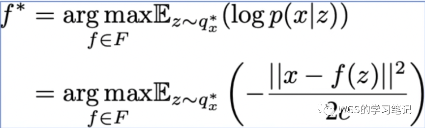

以上就是最终使用的SGVB，作者通过 KL散度 的性质和 Regularization Loss 的近似，给我们提供了一种相对稳定的估计loss和梯度的方法。

## 五、VAE 结构回顾

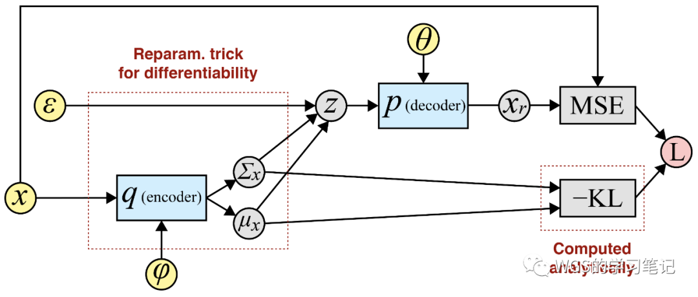

总的来看 Variational Auto-Encoder 的model就是：

- 输入一个 $x$，进了Encoder，这个 Encoder 是由参数来决定的，Encoder 会产生 $μ$和 $σ$；
- $μ$和 $σ$首先被我们用来计算 KL divergence，作为**辅助损失**；
- 同时在 $μ$ 和 $σ$之后我们对它抽样产生一个 $z$，加上 $\epsilon$ 帮我们产生随机的项；
- 得到隐变量 $z$后，放到 Decoder 里，它是由参数 $\theta$ 来决定的；
- 经过这个 Decoder 之后，我们重建出了一个 $x$；
- 对比重建后的 $x$ 和输入 $x$ 之间的 MSE 就构成了loss的另一部分，
- 两个loss加起来就是最终的loss。

这个就是最经典的 Variational Auto-Encoder。

对比第一大节AE的图，可以画成一下形式：

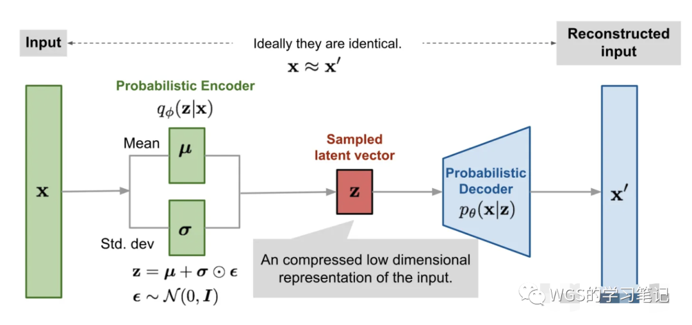

## 六、原文实验

作者基于MNIST 和 Frey Face做了实验验证，看下原文的结果图：

首先作者说了使用不同的学习方法能把这个 lower bound 提升多少，lower bound 的提升越大，说明 Encoder 和我们想要逼近的这个Distruction，它的KL散度是越来越小。


由图中可以看出AEVB与wake-sleep算法的比较，可以看出AEVB训练效果更好。且随着隐变量维度增大，并未出现过拟合现象。


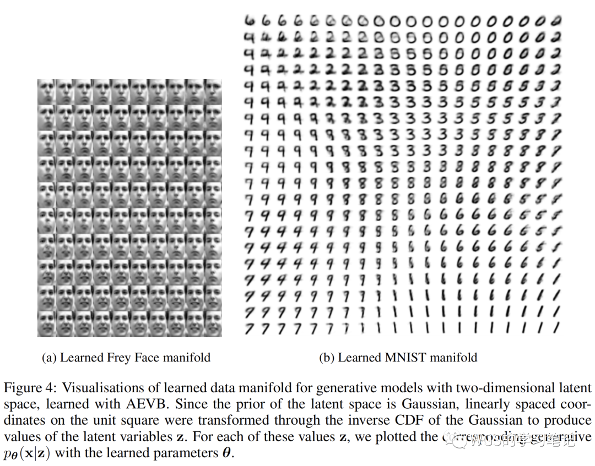
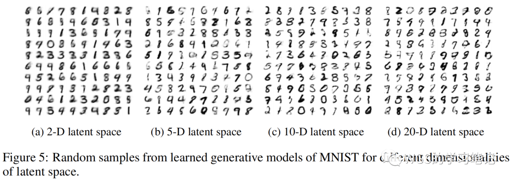

图4是限定2个维度的隐变量 $z$，并调节两个维度的值，生成的图片。

图5是不同维度的隐变量随机采样的图片。

## 七、torch复现 AE、VAE

https://wangguisen.blog.csdn.net/article/details/128476638

## References

[1]. https://arxiv.org/abs/1312.6114 
[2]. http://www.gwylab.com/note-vae.html 
[3]. https://zhuanlan.zhihu.com/p/452743042 
[4]. https://www.bilibili.com/video/BV1q64y1y7J2/ 
[5]. https://www.bilibili.com/video/av15889450/?p=33 
[6]. https://gregorygundersen.com/blog/2018/04/29/reparameterization/ 
 
[7]. https://mp.weixin.qq.com/s?__biz=Mzk0MzIzODM5MA==&mid=2247486014&idx=1&sn=2ff34f72c869907408ed1b08bec1a238&chksm=c337b7a7f4403eb14a1b5cdc3e1a1b11dca6f957591957cc29a4c270f0ace0a4674a7ae33214&scene=21#wechat_redirect

---

> 作者: [Jian YE](https://github.com/jianye0428)  
> URL: https://jianye0428.github.io/posts/vae_1/  

